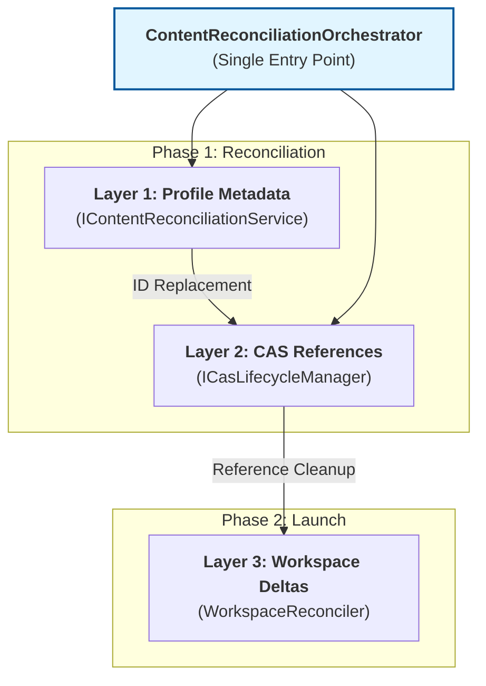
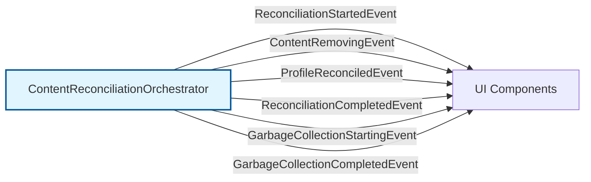
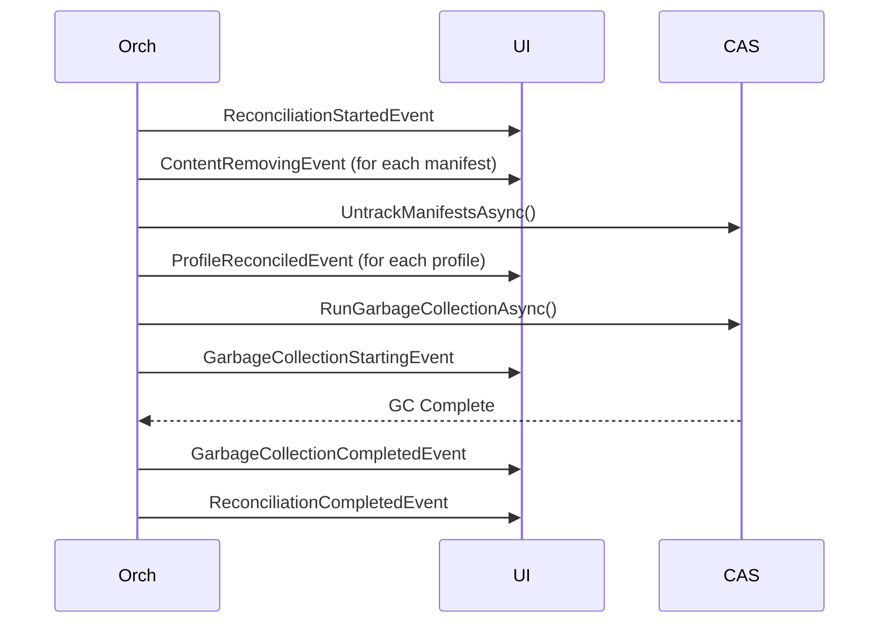

# Reconciliation Architecture Overview

GenHub uses a three-layer reconciliation system to ensure that content changes (renames, updates, deletions) are propagated correctly from the manifest level down to the physical workspace on the user's disk.

All reconciliation operations are now coordinated through a single **`ContentReconciliationOrchestrator`** entry point, which enforces correct operation ordering and provides comprehensive audit logging.

## The Three Layers

> **Note**: The `ContentReconciliationOrchestrator` is the single entry point for all reconciliation operations. It enforces correct ordering: Update Profiles → Track New → Untrack Old → Remove Old → GC.

### 1. Profile Metadata Layer

When local content is edited (e.g., renamed) or a new version of GeneralsOnline is acquired:

- The `IContentReconciliationService` identifies all profiles that reference the old `ManifestId`.
- It updates the `EnabledContentIds` list in each profile to use the new `ManifestId`.
- It clears the `ActiveWorkspaceId` of the profile, signalling that the existing workspace is stale.
- This layer is invoked by the orchestrator via `ReconcileBulkManifestReplacementAsync()` or similar bulk operations.

### 2. CAS Reference Layer

Content-Addressable Storage (CAS) uses reference counting to prevent physical files from being deleted if they are still needed:

- **Manifest Tracking**: When a manifest is stored, `CasReferenceTracker` records all file hashes it needs.
- **Workspace Tracking**: When a workspace is prepared, it also tracks the hashes it physically uses.
- **Reference Lifespan**: A file remains in CAS as long as at least one manifest or workspace references it.
- **Garbage Collection**: Orphaned files (no references) are removed after a 7-day grace period (configurable).

The `ICasLifecycleManager` provides atomic reference management operations:

- **`ReplaceManifestReferencesAsync()`**: Atomically tracks new manifest references before untracking old ones
- **`UntrackManifestsAsync()`**: Safely removes references for specified manifests
- **`RunGarbageCollectionAsync()`**: Executes garbage collection (must be called after untrack operations)
- **`GetReferenceAuditAsync()`**: Provides diagnostics and statistics on current CAS reference state

### 3. Workspace Delta Layer

The physical sync happens at **launch time**:

- `WorkspaceManager.PrepareWorkspaceAsync` compares the profile's requested manifests against the cached manifests in the existing workspace.
- If they differ, the `WorkspaceReconciler` performs a "Delta Sync":
  - **Skip**: Files already present and matching by hash (or size if no hash available).
  - **Add**: New files from new manifests.
  - **Update**: Files with the same relative path but different content. Hash verification is performed for **all** files with a known hash to ensure changes are detected even if file size remains identical (e.g., config changes, small binary patches).
  - **Remove**: Files belonging to manifests no longer enabled.

## Key Orchestration Flows

### Content Update (Rename/Edit)

1. Create New Manifest (New ID).
2. **Reconcile Profiles**: Update all `EnabledContentIds`.
3. **Reconcile CAS**: Track new manifest references, untrack old ones.
4. Delete Old Manifest.
5. **Launch Sync**: Workspace detects change and updates files.

### Content Deletion

1. **Reconcile Profiles**: Remove ID from all `EnabledContentIds`.
2. **Reconcile CAS**: Untrack manifest references.
3. Delete Manifest.
4. **Launch Sync**: Workspace detects missing manifest and removes corresponding files.

## Event-Driven Pipeline

The reconciliation system uses `WeakReferenceMessenger` (CommunityToolkit.Mvvm.Messaging) to broadcast events throughout the application, enabling loose coupling and real-time UI updates.

### Event Types

- **`ReconciliationStartedEvent`**: Fired when a reconciliation operation begins, includes operation ID and expected scope
- **`ContentRemovingEvent`**: Fired before content removal, allowing listeners to prepare (e.g., close files, save state)
- **`ProfileReconciledEvent`**: Fired when each profile is updated, with old and new manifest ID lists
- **`ReconciliationCompletedEvent`**: Fired when operation completes, with success status, duration, and affected counts
- **`GarbageCollectionStartingEvent`**: Fired before GC runs, indicates whether forced and estimated orphan count
- **`GarbageCollectionCompletedEvent`**: Fired after GC completes, with objects scanned, deleted, and bytes freed

### Event Flow Example

## Audit Trail

The `IReconciliationAuditLog` provides comprehensive tracking of all reconciliation operations for debugging, diagnostics, and compliance purposes.

### Audit Capabilities

- **Operation Logging**: Every reconciliation operation is logged with a unique operation ID
- **State Capture**: Before/after snapshots of profile states and CAS references
- **Error Tracking**: Detailed error information with stack traces and context
- **Performance Metrics**: Duration of each operation phase
- **Correlation**: Links related operations (e.g., profile updates triggered by content replacement)

### Audit Log Entries

Each audit entry contains:

- **Operation ID**: Unique identifier (8-character hex string)
- **Timestamp**: When the operation occurred
- **Operation Type**: ContentReplacement, ContentDeletion, ProfileReconciliation, etc.
- **Request Details**: Input parameters and manifest mappings
- **Result**: Success/failure status and any warnings
- **Metrics**: Profiles affected, manifests processed, bytes freed (if GC run)
- **Duration**: Total operation time

### Querying the Audit Log

The audit log supports querying by:

- **Operation ID**: Retrieve details for a specific operation
- **Time Range**: Find operations within a date window
- **Operation Type**: Filter by reconciliation operation type
- **Profile ID**: Find all operations affecting a specific profile
- **Manifest ID**: Track lifecycle of specific content

This audit trail is invaluable for:

- **Debugging**: Understanding why a profile or workspace is in a particular state
- **Compliance**: Verifying that cleanup operations completed correctly
- **Performance Analysis**: Identifying slow operations or bottlenecks
- **Recovery**: Determining what needs to be re-run after a failure
