## Flowchart: Downloads User Flow

This flowchart details the complete user journey from browsing publishers to downloading and installing content, including state management, profile selection, and caching.

## Table of Contents

1. [User Browsing Flow](#user-browsing-flow)
2. [Content State Management](#content-state-management)
3. [Publisher Selection](#publisher-selection)
4. [Content Acquisition Flow (Updated)](#content-acquisition-flow-updated)
5. [Profile Selection Flow](#profile-selection-flow)
6. [ModDB Integration](#moddb-integration)
7. [Content Caching Layer](#content-caching-layer)
8. [Key Components](#key-components)
9. [Error Handling](#error-handling)

## User Browsing Flow

```mermaid
%%{init: {
  'theme': 'base',
  'themeVariables': {
    'primaryColor': '#e2e8f0',
    'primaryTextColor': '#1a202c',
    'primaryBorderColor': '#4a5568',
    'lineColor': '#2d3748',
    'background': '#ffffff'
  }
}}%%

flowchart TD
    subgraph User["👤 User Actions"]
        A["Open Downloads Tab"]
        B["Select Publisher<br/>(ModDB, CNC Labs, etc.)"]
        C["Browse/Search Content"]
        D["Click Content Card"]
        E["View Details"]
        F["Click Download"]
    end

    subgraph ViewModel["📱 DownloadsBrowserViewModel"]
        V1["LoadPublishersAsync()"]
        V2["SetSelectedPublisher()"]
        V3["DiscoverContentAsync()"]
        V4["OpenContentDetail()"]
        V5["DownloadContentCommand"]
    end

    subgraph Pipeline["🔧 Content Pipeline"]
        P1["IContentDiscoverer"]
        P2["ContentDiscoveryResult"]
        P3["IContentResolver"]
        P4["IContentManifestFactory"]
    end

    subgraph Storage["💾 Storage"]
        S1["CAS Service"]
        S2["Manifest Pool"]
        S3["Profile Integration"]
    end

    A --> V1
    V1 --> B
    B --> V2
    V2 --> V3
    V3 --> P1
    P1 --> P2
    P2 --> C
    C --> D
    D --> V4
    V4 --> E
    E --> F
    F --> V5
    V5 --> P3
    P3 --> P4
    P4 --> S1
    P4 --> S2
    S2 --> S3

    classDef user fill:#3182ce,stroke:#2c5282,stroke-width:2px,color:#ffffff
    classDef viewmodel fill:#805ad5,stroke:#6b46c1,stroke-width:2px,color:#ffffff
    classDef pipeline fill:#38a169,stroke:#2f855a,stroke-width:2px,color:#ffffff
    classDef storage fill:#e53e3e,stroke:#c53030,stroke-width:2px,color:#ffffff

    class A,B,C,D,E,F user
    class V1,V2,V3,V4,V5 viewmodel
    class P1,P2,P3,P4 pipeline
    class S1,S2,S3 storage
```

## Content State Management

The `ContentStateService` determines the current state of content for UI display, enabling the Downloads browser to show appropriate buttons (Download, Update, Add to Profile) based on content availability.

### State Flow Diagram

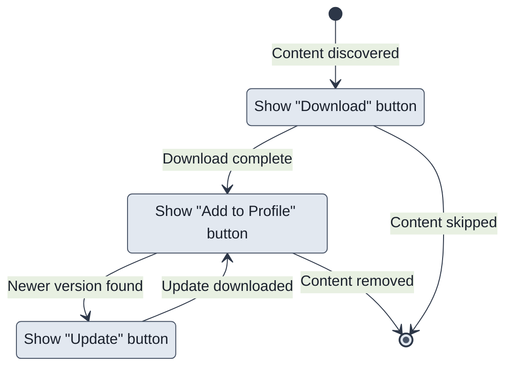

### ContentStateService

**Location**: `GenHub/Features/Downloads/Services/ContentStateService.cs`

The service uses the 5-segment manifest ID format to detect content versions:

```text
Format: schemaVersion.userVersion.publisher.contentType.contentName
Example: 1.20240315.moddb.mod.releasename
```

**Detection Logic**:

1. **Exact Match Check**: Generates prospective manifest ID using `ManifestIdGenerator.GeneratePublisherContentId(publisher, contentType, name, releaseDate)`
2. **Update Detection**: Searches for manifests with same publisher, contentType, and contentName but older userVersion (date)
3. **State Determination**:
   - `Downloaded`: Exact match found in manifest pool
   - `UpdateAvailable`: Older version found
   - `NotDownloaded`: No versions found

**Usage Example**:

```csharp
var state = await contentStateService.GetStateAsync(searchResult);
switch (state)
{
    case ContentState.NotDownloaded:
        // Show Download button
        break;
    case ContentState.UpdateAvailable:
        // Show Update button
        break;
    case ContentState.Downloaded:
        // Show "Add to Profile" button
        break;
}
```

### Content State Sequence Diagram

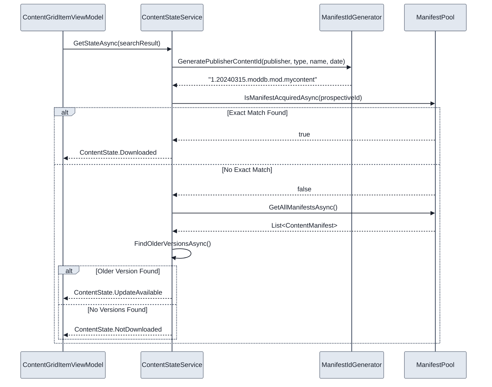

## Publisher Selection

```mermaid
%%{init: {
  'theme': 'base',
  'themeVariables': {
    'primaryColor': '#e2e8f0',
    'primaryTextColor': '#1a202c',
    'primaryBorderColor': '#4a5568',
    'lineColor': '#2d3748',
    'background': '#ffffff'
  }
}}%%

flowchart LR
    subgraph Sidebar["Publisher Sidebar"]
        P1["🎮 ModDB"]
        P2["🗺️ CNC Labs"]
        P3["🗺️ AOD Maps"]
        P4["🔧 Community Outpost"]
        P5["🐙 GitHub"]
        P6["🌐 Generals Online"]
    end

    subgraph Filter["Filter Panel"]
        F1["Content Type"]
        F2["Game (Generals/ZH)"]
        F3["Search Term"]
        F4["Sort Order"]
    end

    subgraph Grid["Content Grid"]
        G1["ContentCardView 1"]
        G2["ContentCardView 2"]
        G3["ContentCardView n..."]
    end

    P1 & P2 & P3 & P4 & P5 & P6 --> Filter
    Filter --> Grid
```

## Content Acquisition Flow (Updated)

This sequence diagram shows the complete flow from download to profile integration, including state detection and profile selection.

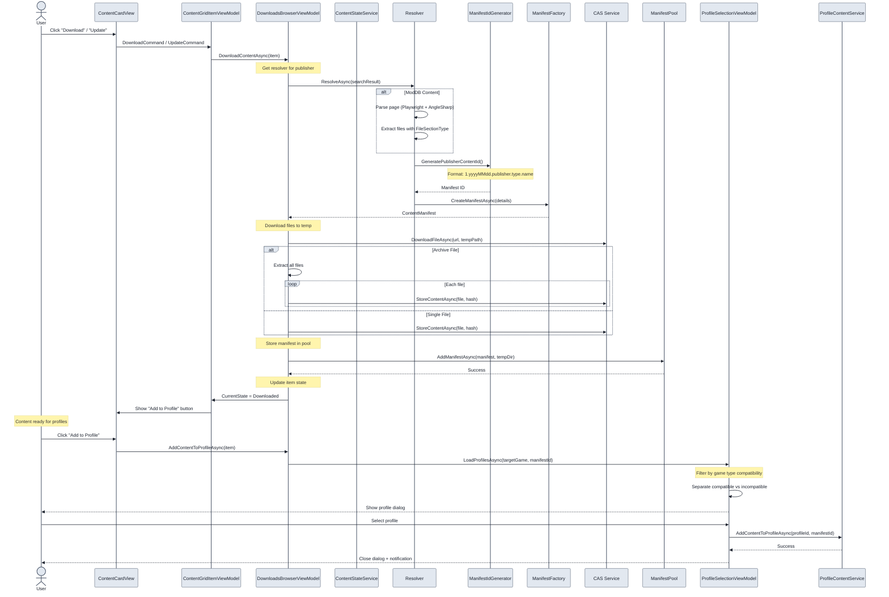

## Profile Selection Flow

The `ProfileSelectionViewModel` provides smart filtering for game profiles, showing compatible profiles first and incompatible profiles with warnings. This ensures content is added to the correct game type profile.

### Profile Selection Diagram

```mermaid
%%{init: {
  'theme': 'base',
  'themeVariables': {
    'primaryColor': '#e2e8f0',
    'primaryTextColor': '#1a202c',
    'primaryBorderColor': '#4a5568',
    'lineColor': '#2d3748',
    'background': '#ffffff'
  }
}}%%

flowchart TD
    subgraph Dialog["ProfileSelectionView"]
        direction TB
        Header["Select Profile for: {ContentName}"]

        subgraph Compatible["✅ Compatible Profiles"]
            C1["Profile 1 (Zero Hour)"]
            C2["Profile 2 (Zero Hour)"]
        end

        subgraph Incompatible["⚠️ Incompatible Profiles"]
            I1["Profile 3 (Generals)<br/>Warning: Content is for Zero Hour"]
            I2["Profile 4 (Generals)<br/>Warning: Content is for Zero Hour"]
        end

        Buttons["Create New Profile | Cancel"]
    end

    User["User clicks profile"] --> SelectProfile[SelectProfileCommand]
    SelectProfile --> PCS[ProfileContentService]
    PCS --> Profile[Add content to profile]
    Profile --> Notify[Show success notification]
```

### Smart Filtering Logic

**Location**: `GenHub/Features/Downloads/ViewModels/ProfileSelectionViewModel.cs`

The profile selection uses the following compatibility rules:

| Content Type | Compatible Profile | Incompatible Profile |
| :--- | :--- | :--- |
| ZeroHour Mod | Zero Hour profiles | Generals profiles |
| Generals Mod | Generals profiles | Zero Hour profiles |

**Key Methods**:

- `LoadProfilesAsync(targetGame, contentManifestId, contentName)` - Loads and filters profiles
- `IsCompatible(profile, targetGame)` - Checks if profile's game type matches content
- `CreateNewProfileAsync()` - Creates a new profile with the content pre-enabled

**Profile Summary Display**:

```text
"2 compatible, 1 incompatible"  - Mixed compatibility
"3 compatible profiles"          - All compatible
"1 incompatible profile"         - All incompatible
"No profiles available"          - No profiles exist
```

### Profile Selection Sequence Diagram

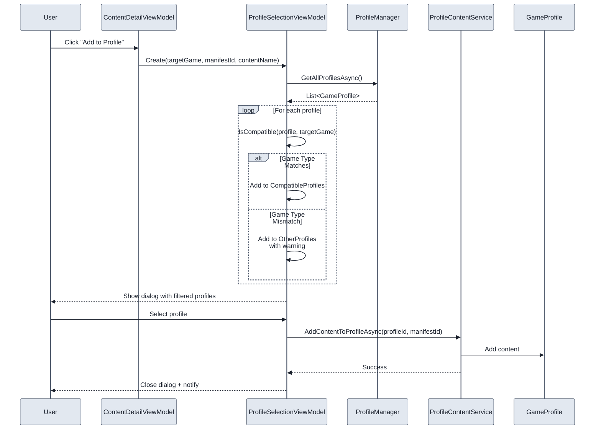

## ModDB Integration

ModDB content discovery uses a two-stage approach: Playwright for JavaScript-rendered content, followed by AngleSharp for structured HTML parsing. The parser distinguishes between main releases (Downloads section) and addons.

### ModDB Parsing Flow

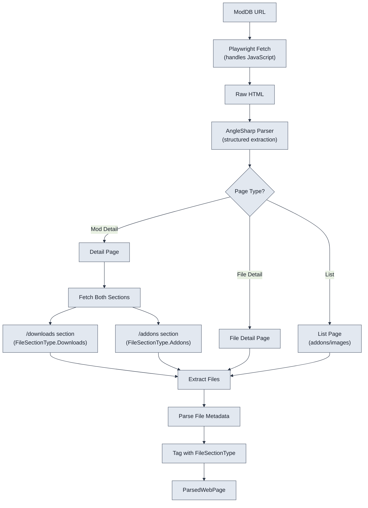

### FileSectionType Enum

**Location**: `GenHub/Core/Models/Parsers/FileSectionType.cs`

```csharp
public enum FileSectionType
{
    /// <summary>Files from the main releases/downloads section</summary>
    Downloads,

    /// <summary>Files from the addons section</summary>
    Addons,
}
```

### Addon-Only Mod Handling

For mods that only have addons (no main downloads):

1. **Detection**: Parser detects mod detail pages without a `/downloads` section
2. **Addons Section**: Fetches `/addons` subsection and parses with `FileSectionType.Addons`
3. **Manifest Creation**: Each addon gets its own manifest with `ContentType.Addon`
4. **Content Type**: Addons are tagged separately from main mod releases

### ModDB Resolver Flow

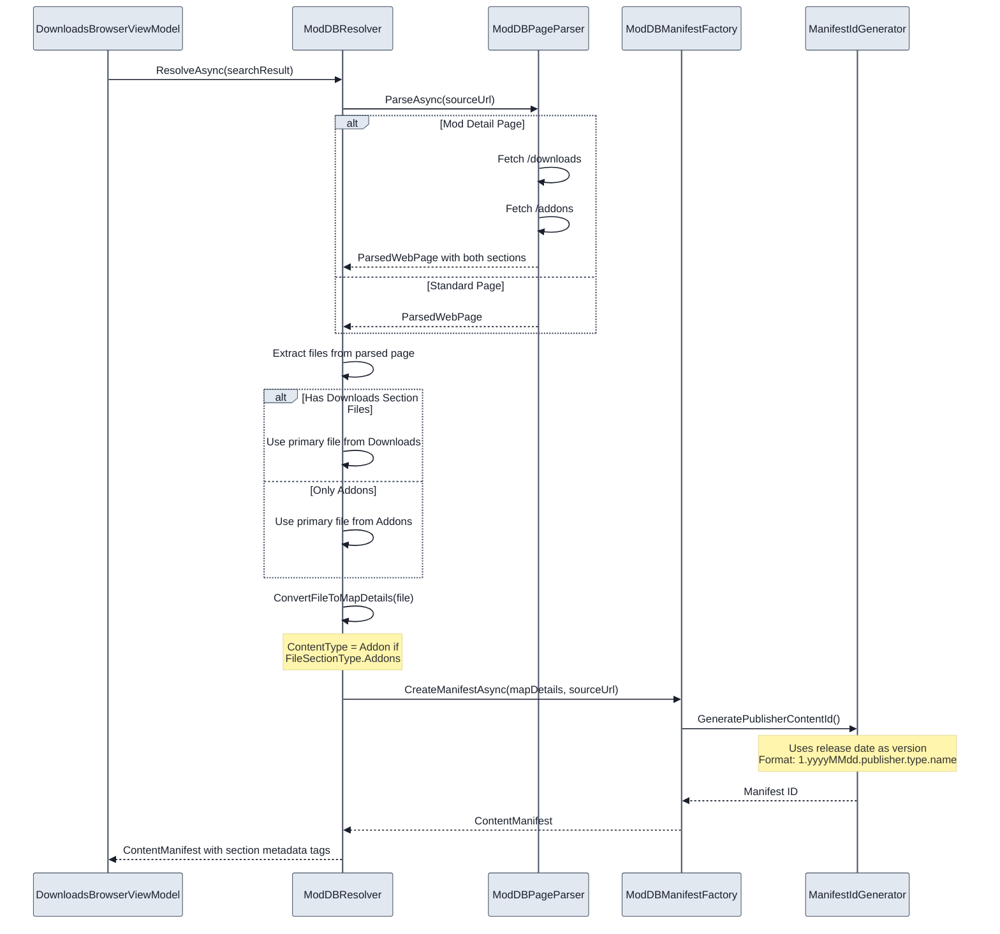

## Content Caching Layer

The `ContentCacheService` provides an in-memory cache for parsed web page content with a configurable TTL (Time To Live). This reduces redundant fetching and parsing of the same pages.

### Cache Architecture

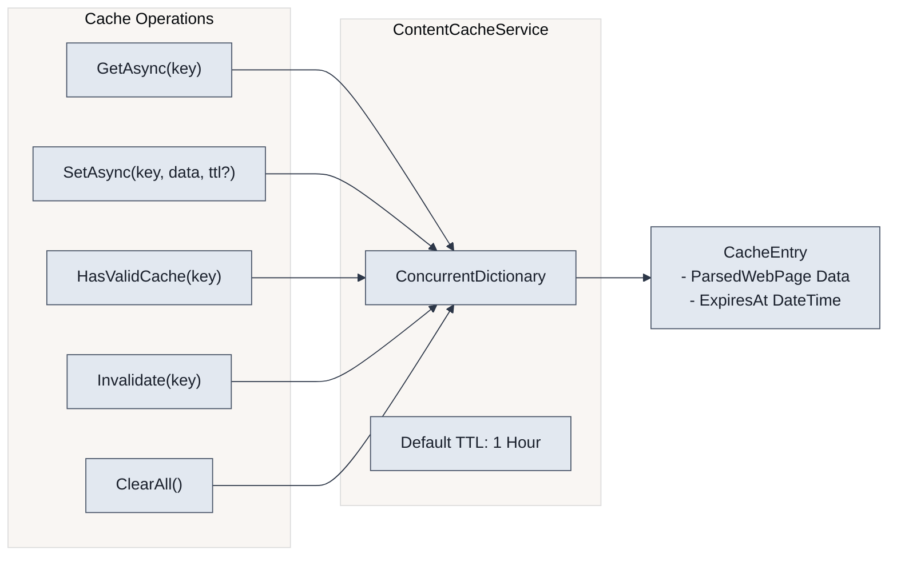

### Cache Service Details

**Location**: `GenHub/Features/Content/Services/ContentCacheService.cs`

| Method | Purpose | Returns |
| :--- | :--- | :--- |
| `GetAsync(cacheKey)` | Retrieve cached content | `ParsedWebPage?` or `null` if expired/missing |
| `SetAsync(cacheKey, data, ttl?)` | Store content in cache | `Task` (completed) |
| `HasValidCache(cacheKey)` | Check if valid cache exists | `bool` |
| `Invalidate(cacheKey)` | Remove specific entry | `void` |
| `ClearAll()` | Clear all cache entries | `void` |

**Cache Entry Structure**:

```csharp
private record CacheEntry(
    ParsedWebPage Data,      // The cached parsed page
    DateTime ExpiresAt       // When the cache expires
);
```

**Default TTL**: 1 hour (`TimeSpan.FromHours(1)`)

### Lazy Loading for Tabs

The `ContentDetailViewModel` implements lazy loading for detail view tabs to improve performance:

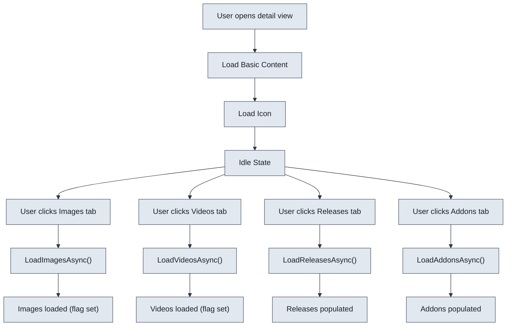

**Lazy Load Flags**:

- `_imagesLoaded` - Prevents re-loading images tab
- `_videosLoaded` - Prevents re-loading videos tab
- `_releasesLoaded` - Prevents re-loading releases tab
- `_addonsLoaded` - Prevents re-loading addons tab
- `_basicContentLoaded` - Basic page info loaded on open

## Key Components

### DownloadsBrowserViewModel

**Location**: `GenHub/Features/Downloads/ViewModels/DownloadsBrowserViewModel.cs`

| Property/Command | Type | Purpose |
| :--- | :--- | :--- |
| `Publishers` | `ObservableCollection<PublisherItemViewModel>` | Available content sources |
| `SelectedPublisher` | `PublisherItemViewModel` | Currently selected publisher |
| `ContentItems` | `ObservableCollection<ContentGridItemViewModel>` | Discovered content |
| `FilterViewModel` | `IFilterPanelViewModel` | Publisher-specific filters |
| `DownloadContentCommand` | `IAsyncRelayCommand` | Initiates download |
| `AddContentToProfileCommand` | `IAsyncRelayCommand` | Adds content to profile |

### ContentGridItemViewModel

**Location**: `GenHub/Features/Downloads/ViewModels/ContentGridItemViewModel.cs`

Represents a single content item in the grid with:

- Title, description, preview image
- Publisher info and tags
- Download URL and content type
- Installation status tracking via `CurrentState` property

**State-Dependent UI Properties**:

| Property | Condition | Purpose |
| :--- | :--- | :--- |
| `ShowDownloadButton` | `CurrentState == NotDownloaded` | Shows download button |
| `ShowUpdateButton` | `CurrentState == UpdateAvailable` | Shows update button |
| `ShowAddToProfileButton` | `CurrentState == Downloaded` | Shows "Add to Profile" button |
| `CanDownload` | `!IsDownloaded && !IsDownloading` | Enables download action |

### ContentDetailViewModel

**Location**: `GenHub/Features/Downloads/ViewModels/ContentDetailViewModel.cs`

Provides detailed content view with lazy-loaded tabs:

- **Overview Tab**: Basic content info (loaded immediately)
- **Images Tab**: Gallery images (loaded on first access)
- **Videos Tab**: Embedded videos (loaded on first access)
- **Releases Tab**: Main downloads section files (loaded on first access)
- **Addons Tab**: Addon section files (loaded on first access)

**Lazy Loading Implementation**:

```csharp
private bool _imagesLoaded;
private bool _videosLoaded;
private bool _releasesLoaded;
private bool _addonsLoaded;
private bool _basicContentLoaded;

[RelayCommand]
private async Task LoadImagesAsync()
{
    if (_imagesLoaded || IsLoadingImages) return;
    // ... load images
    _imagesLoaded = true;
}
```

### Filter ViewModels

Each publisher has a specialized filter ViewModel:

| Publisher | Filter ViewModel | Special Filters |
| :--- | :--- | :--- |
| ModDB | `ModDBFilterViewModel` | Category, release date |
| CNC Labs | `CNCLabsFilterViewModel` | Map size, player count |
| AOD Maps | `AODMapsFilterViewModel` | Map type |
| Community Outpost | `CommunityOutpostFilterViewModel` | Tool vs patch |
| GitHub | `GitHubFilterViewModel` | Repository, release type |

### ContentStateService Reference

**Location**: `GenHub/Features/Downloads/Services/ContentStateService.cs`

| Method | Purpose |
| :--- | :--- |
| `GetStateAsync(item)` | Gets current state (NotDownloaded, UpdateAvailable, Downloaded) |
| `GetLocalManifestIdAsync(item)` | Returns local manifest ID if downloaded |

### ProfileSelectionViewModel

**Location**: `GenHub/Features/Downloads/ViewModels/ProfileSelectionViewModel.cs`

| Property | Type | Purpose |
| :--- | :--- | :--- |
| `CompatibleProfiles` | `ObservableCollection<ProfileOptionViewModel>` | Matching game type profiles |
| `OtherProfiles` | `ObservableCollection<ProfileOptionViewModel>` | Non-matching profiles with warnings |
| `ProfileSummary` | `string` | Human-readable profile counts |
| `SelectProfileCommand` | `IAsyncRelayCommand` | Adds content to selected profile |
| `CreateNewProfileCommand` | `IAsyncRelayCommand` | Creates new profile with content |

## Error Handling

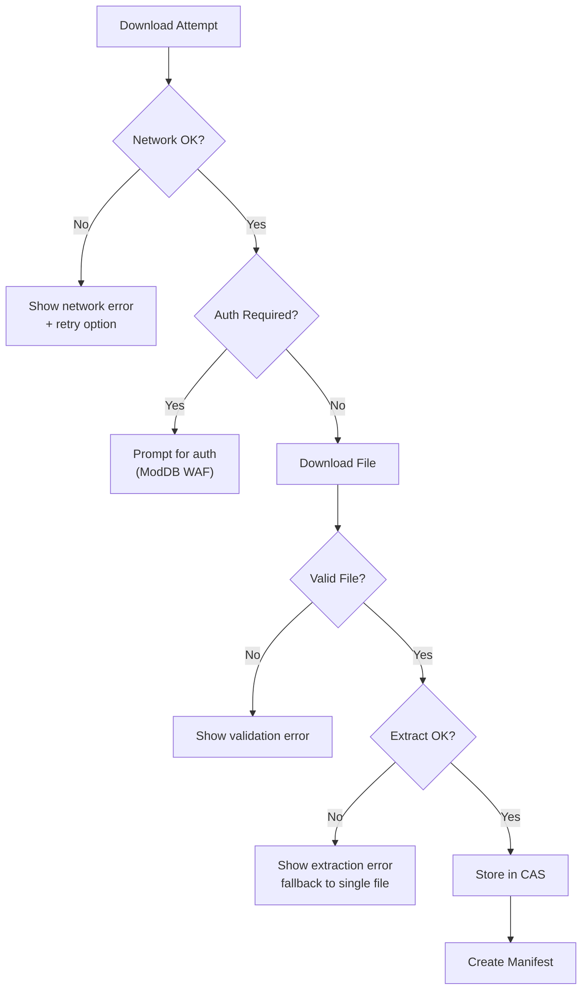

## Related Documentation

- [Content Pipeline](./content-pipeline.md) - Detailed pipeline architecture
- [Discovery Flow](../FlowCharts/Discovery-Flow.md) - Discovery process
- [Acquisition Flow](../FlowCharts/Acquisition-Flow.md) - Content acquisition
