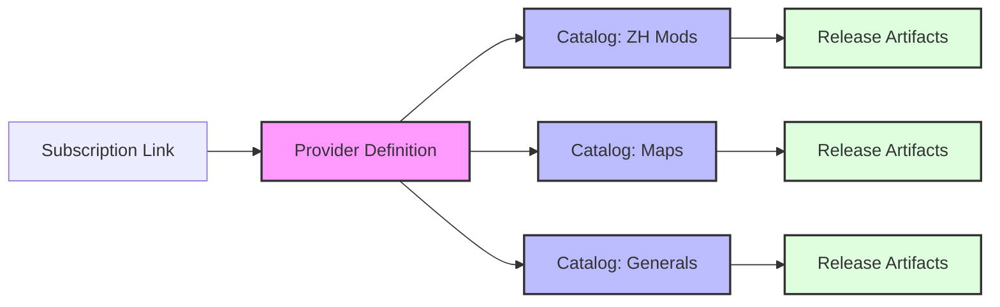

# Publisher Studio: 3-Tier URL Architecture

GenHub utilizes a distributed, 3-tier URL architecture for content publishing. This design ensures that content remains accessible even if hosting providers change, while providing a seamless subscription experience for users.

---

## Architecture Overview



### The Three Tiers

| Tier | File | Purpose | URL Stability |
|------|------|---------|---------------|
| **1. Definition** | `publisher.json` | Publisher identity + catalog pointers | **Permanent** (updated in-place) |
| **2. Catalog(s)** | `catalog-*.json` | Content listings with releases | **Permanent** (updated in-place) |
| **3. Artifacts** | `*.zip` | Downloadable mod/map files | **Immutable** (new URL per version) |

---

## Tier 1: Provider Definition (`publisher.json`)

The **Entry Point**. This file contains the publisher's identity, branding, and links to all their catalogs.

### Schema

```json
{
  "$schemaVersion": 1,
  "publisher": {
    "id": "my-awesome-mods",
    "name": "My Awesome Mods",
    "description": "High-quality mods for Generals and Zero Hour",
    "websiteUrl": "https://github.com/myname",
    "avatarUrl": "https://github.com/myname.png",
    "supportUrl": "https://discord.gg/myserver",
    "contactEmail": "contact@example.com"
  },
  "catalogs": [
    {
      "id": "zh-mods",
      "name": "Zero Hour Mods",
      "description": "Mods for Command & Conquer Generals: Zero Hour",
      "url": "https://drive.google.com/uc?export=download&id=CAT_123",
      "mirrors": []
    },
    {
      "id": "maps",
      "name": "Map Packs",
      "description": "Custom maps for multiplayer",
      "url": "https://drive.google.com/uc?export=download&id=CAT_456",
      "mirrors": []
    }
  ],
  "definitionUrl": "https://drive.google.com/uc?export=download&id=DEF_789",
  "previousDefinitionUrls": [],
  "referrals": [],
  "tags": ["mods", "maps", "zero-hour"],
  "lastUpdated": "2026-01-24T00:00:00Z"
}
```

### Key Fields

| Field | Purpose |
|-------|---------|
| `$schemaVersion` | Schema version (1 for multi-catalog support) |
| `publisher` | Publisher identity and branding |
| `catalogs` | Array of catalog entries (id, name, url, mirrors) |
| `definitionUrl` | Self-reference for migration support |
| `previousDefinitionUrls` | URL migration trail for self-healing |
| `catalogUrl` | Convenience property (maps to `catalogs[0].url`) |

---

## Tier 2: Publisher Catalog (`catalog.json`)

The **Content Index**. Lists all content items and their releases.

### Structure

```json
{
  "$schemaVersion": 1,
  "publisher": { ... },
  "content": [
    {
      "id": "super-balance-mod",
      "name": "Super Balance Mod",
      "description": "Rebalances all factions",
      "contentType": "Mod",
      "targetGame": "ZeroHour",
      "tags": ["balance", "multiplayer"],
      "releases": [
        {
          "version": "2.0.0",
          "releaseDate": "2026-01-24T00:00:00Z",
          "isLatest": true,
          "changelog": "## 2.0.0\n- Major rebalance\n- New units",
          "artifacts": [
            {
              "filename": "SuperBalanceMod-2.0.0.zip",
              "downloadUrl": "https://drive.google.com/uc?export=download&id=ZIP_ABC",
              "size": 15728640,
              "sha256": "abc123...",
              "isPrimary": true
            }
          ],
          "dependencies": []
        }
      ]
    }
  ],
  "lastUpdated": "2026-01-24T00:00:00Z"
}
```

---

## Tier 3: Release Artifacts

The **Binary Files**. Actual ZIP/RAR/7z files hosted on Google Drive, GitHub, or other CDNs.

### URL Stability Rules

| Operation | URL Behavior |
|-----------|--------------|
| **New release** | New artifact = new URL (immutable) |
| **Bug fix** | New version = new URL (don't overwrite) |
| **Old versions** | Keep URLs alive for rollback support |

**Important**: Never delete old artifact URLs. Users may have pinned specific versions.

---

## Hosting: Google Drive Integration

GenHub's Publisher Studio integrates with Google Drive for hosting. This provides:

- **Free hosting** for catalogs and artifacts
- **Stable URLs** via file ID (update content, keep same URL)
- **OAuth authentication** (no manual token management)
- **Automatic folder organization**

### File Structure on Drive

```
📁 GenHub_Publisher/
├── publisher.json       (ID: DEF_789)  ← Tier 1: Definition
├── catalog-zh-mods.json (ID: CAT_123)  ← Tier 2: Catalog
├── catalog-maps.json    (ID: CAT_456)  ← Tier 2: Catalog
├── supermod-v1.0.zip    (ID: ZIP_111)  ← Tier 3: Artifact (v1.0)
└── supermod-v2.0.zip    (ID: ZIP_222)  ← Tier 3: Artifact (v2.0)
```

### URL Format

Google Drive direct download URLs:
```
https://drive.google.com/uc?export=download&id={FILE_ID}
```

### Update Semantics

| File Type | First Publish | Subsequent Publish |
|-----------|---------------|-------------------|
| Definition | `Files.Create()` → new ID | `Files.Update()` → same ID |
| Catalog | `Files.Create()` → new ID | `Files.Update()` → same ID |
| Artifact | `Files.Create()` → new ID | `Files.Create()` → **new ID** (immutable) |

---

## Hosting State Persistence

The `hosting_state.json` file (stored alongside the project) tracks all uploaded file IDs:

```json
{
  "providerId": "google_drive",
  "folderId": "FOLDER_ABC",
  "definition": {
    "fileId": "DEF_789",
    "url": "https://drive.google.com/uc?export=download&id=DEF_789",
    "lastUpdated": "2026-01-24T00:00:00Z"
  },
  "catalogs": [
    {
      "catalogId": "zh-mods",
      "fileId": "CAT_123",
      "url": "https://drive.google.com/uc?export=download&id=CAT_123",
      "lastUpdated": "2026-01-24T00:00:00Z"
    }
  ],
  "artifacts": [
    {
      "contentId": "super-mod",
      "version": "2.0.0",
      "fileId": "ZIP_222",
      "url": "https://drive.google.com/uc?export=download&id=ZIP_222"
    }
  ],
  "lastPublished": "2026-01-24T00:00:00Z"
}
```

### Recovery

If `hosting_state.json` is lost, GenHub can recover by scanning the `GenHub_Publisher/` folder on Drive and matching filenames to rebuild the state.

---

## Multi-Catalog Support

### Why Multiple Catalogs?

Publishers can organize content into separate catalogs:
- **By game**: "ZH Mods", "Generals Mods"
- **By type**: "Mods", "Maps", "Tools"
- **By audience**: "Competitive", "Casual"

### User Experience

When subscribing to a multi-catalog publisher:
1. Confirmation dialog shows all available catalogs
2. User can enable/disable individual catalogs
3. Sidebar shows publisher with catalog tabs
4. "All" tab shows merged content from all enabled catalogs

### Data Flow

```
Definition (1) ──┬──> Catalog: ZH Mods ──> Content Items
                 ├──> Catalog: Maps ──────> Content Items
                 └──> Catalog: Generals ──> Content Items
```

---

## Resolution Flow

### Subscription

1. User clicks `genhub://subscribe?url=https://.../publisher.json`
2. GenHub fetches the definition
3. User sees confirmation with publisher info and catalog list
4. User selects catalogs to subscribe
5. `PublisherSubscription` stored with `CatalogEntries[]`

### Content Discovery

1. User clicks publisher in sidebar
2. `GenericCatalogDiscoverer` fetches all enabled catalogs
3. Content merged and displayed with catalog tabs
4. User can filter by catalog tab

### Content Installation

1. User clicks "Install" on content item
2. `GenericCatalogResolver` builds `ContentManifest` from catalog entry
3. `HttpContentDeliverer` downloads artifact from Tier 3 URL
4. `GenericCatalogManifestFactory` extracts and stores files in CAS

---

## Best Practices

### For Publishers

1. **Use Google Drive hosting** - Free, stable URLs, automatic management
2. **One definition, multiple catalogs** - Organize content logically
3. **Never delete old artifacts** - Users may need specific versions
4. **Keep definitions updated** - Use `definitionUrl` for self-reference

### For Dependencies

1. **Point to definitions, not catalogs** - More stable
2. **Include `catalogUrl` in dependencies** - For discovery
3. **Use semantic version constraints** - `>=1.0.0`, `^2.0.0`

---

## Related Documentation

- [Publisher Studio User Guide](../features/tools/publisher-studio.md)
- [Creator Publishing](../features/content/creator-publishing.md)
- [Content Pipeline](../features/content/content-pipeline.md)
- [Manifest ID System](./manifest-id-system.md)
