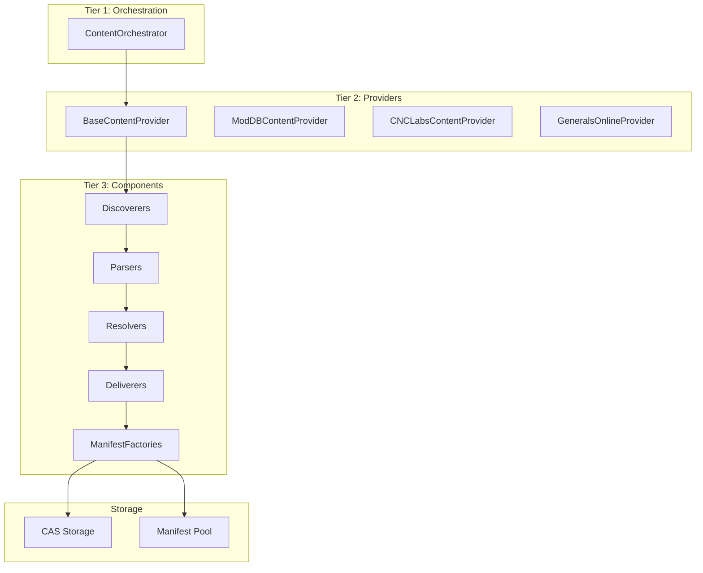
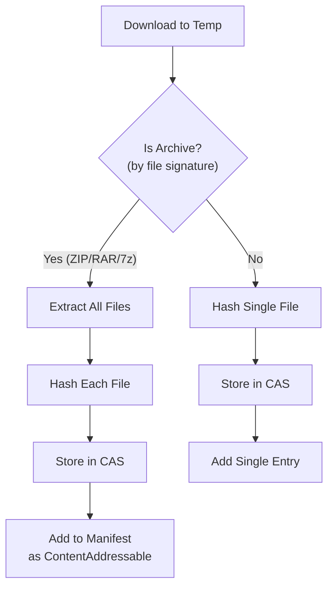
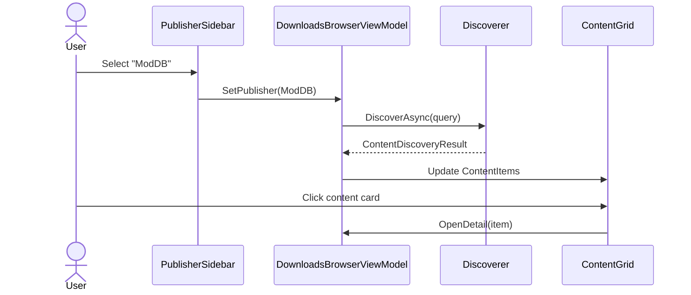
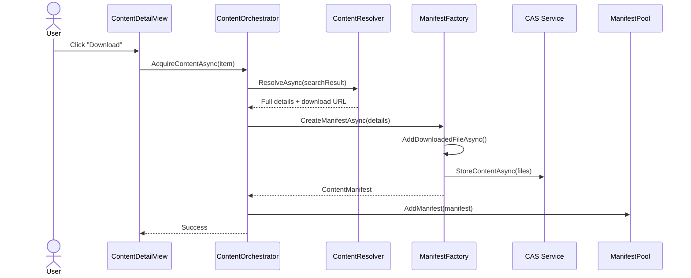
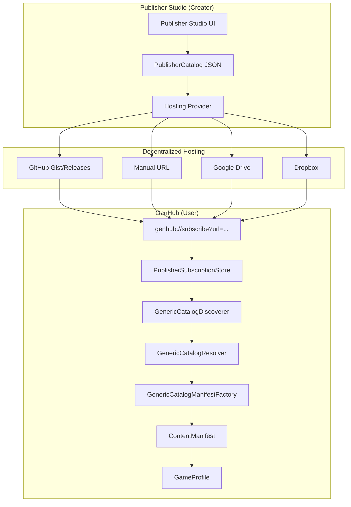
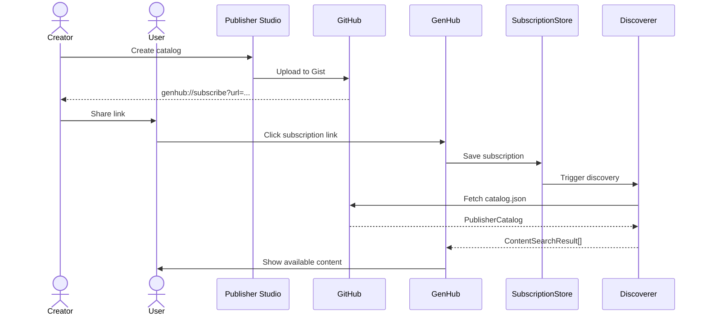

# Content Pipeline Architecture

The GenHub content system uses a **three-tier pipeline architecture** that transforms external content sources into installable content with full manifest and CAS (Content-Addressable Storage) integration.

## Pipeline Overview



## Tier 1: ContentOrchestrator

**Location**: `GenHub.Core/Interfaces/Content/IContentOrchestrator.cs`

The orchestrator is the system-wide coordinator for all content operations.

### Responsibilities

| Operation | Method | Description |
| :--- | :--- | :--- |
| **Search** | `SearchAsync()` | Broadcasts query to all providers, aggregates results |
| **Acquire** | `AcquireContentAsync()` | Downloads, extracts, stores, and registers content |
| **Cache** | `IDynamicContentCache` | System-wide caching for performance |

### Search Flow

```csharp
// User initiates search in DownloadsBrowserView
var results = await _orchestrator.SearchAsync(new ContentSearchQuery
{
    SearchTerm = "Rise of the Reds",
    ContentType = ContentType.Mod,
    TargetGame = GameType.ZeroHour
});
```

---

## Tier 2: Content Providers

**Base**: `GenHub/Features/Content/Services/ContentProviders/BaseContentProvider.cs`

Providers are source-specific facades that orchestrate the internal pipeline.

### Provider Pattern

```csharp
public abstract class BaseContentProvider : IContentProvider
{
    protected abstract IContentDiscoverer Discoverer { get; }
    protected abstract IContentResolver Resolver { get; }
    protected abstract IContentDeliverer Deliverer { get; }

    // Common pipeline orchestration
    public virtual async Task<OperationResult<IEnumerable<ContentSearchResult>>> SearchAsync(
        ContentSearchQuery query, CancellationToken cancellationToken = default)
    {
        var providerDefinition = GetProviderDefinition();
        return await Discoverer.DiscoverAsync(providerDefinition, query, cancellationToken);
    }
}

### Registered Providers

| Provider | Discoverer | Parser | Notes |
| :--- | :--- | :--- | :--- |
| **Generic Catalog** | `GenericCatalogDiscoverer` | `JsonPublisherCatalogParser` | **Publisher Studio catalogs** - Decentralized creator content |
| **ModDB** | `ModDBDiscoverer` | `ModDBPageParser` (AngleSharp) | Uses Playwright for WAF bypass |
| **CNC Labs** | `CNCLabsMapDiscoverer` | AngleSharp HTML | Direct HTTP scraping |
| **AOD Maps** | `AODMapsDiscoverer` | `AODMapsPageParser` | Pagination support |
| **Community Outpost** | `CommunityOutpostDiscoverer` | `GenPatcherDatCatalogParser` | `.dat` catalog format |
| **GitHub** | `GitHubDiscoverer` | GitHub API JSON | Release assets |
| **Generals Online** | `GeneralsOnlineDiscoverer` | GitHub API | Multi-variant releases |
| **File System** | `FileSystemDiscoverer` | Direct scan | Local manifests |

---

## Tier 3: Pipeline Components

### Discoverers (`IContentDiscoverer`)

**Location**: `GenHub.Core/Interfaces/Content/IContentDiscoverer.cs`

Discoverers fetch catalog data from external sources and delegate to parsers.

```csharp
public interface IContentDiscoverer : IContentSource
{
    Task<OperationResult<ContentDiscoveryResult>> DiscoverAsync(
        ContentSearchQuery query,
        CancellationToken cancellationToken = default);

    // Overload with provider definition for data-driven configuration
    Task<OperationResult<ContentDiscoveryResult>> DiscoverAsync(
        ProviderDefinition? provider,
        ContentSearchQuery query,
        CancellationToken cancellationToken = default);
}
```

**Key principle**: Discoverers handle network concerns (timeouts, retries, WAF bypass) but do NOT parse data themselves—that's the parser's job.

### Parsers (`ICatalogParser`, `IWebPageParser`)

**Locations**:

- `GenHub.Core/Interfaces/Providers/ICatalogParser.cs`
- `GenHub.Core/Interfaces/Parsers/IWebPageParser.cs`

Parsers transform raw data (HTML, JSON, `.dat` files) into `ContentSearchResult` objects.

| Parser | Format | Source |
| :--- | :--- | :--- |
| `GenPatcherDatCatalogParser` | `.dat` pipe-delimited | Community Outpost |
| `ModDBPageParser` | HTML | ModDB |
| `AODMapsPageParser` | HTML | AOD Maps |
| AngleSharp | Generic HTML | CNC Labs |

### Resolvers (`IContentResolver`)

**Location**: `GenHub.Core/Interfaces/Content/IContentResolver.cs`

Resolvers transform lightweight search results into complete `ContentManifest` blueprints.

```csharp
public interface IContentResolver : IContentSource
{
    Task<OperationResult<ContentManifest>> ResolveAsync(
        ContentSearchResult discoveredItem,
        CancellationToken cancellationToken = default);
}
```

**Resolution tasks**:

1. Fetch detail page for full metadata (description, screenshots)
2. Extract download URL
3. Determine target game and content type
4. Build manifest structure

### Deliverers (`IContentDeliverer`)

**Location**: `GenHub.Core/Interfaces/Content/IContentDeliverer.cs`

Deliverers download content files and prepare them for storage.

```csharp
public interface IContentDeliverer : IContentSource
{
    bool CanDeliver(ContentManifest manifest);

    Task<OperationResult<DeliveryResult>> DeliverContentAsync(
        ContentManifest manifest,
        string targetDirectory,
        CancellationToken cancellationToken = default);
}
```

### Manifest Factories (`IPublisherManifestFactory`)

**Location**: `GenHub.Core/Interfaces/Content/IPublisherManifestFactory.cs`

Factories create proper `ContentManifest` objects after downloading, handling publisher-specific logic.

| Factory | Publisher | Features |
| :--- | :--- | :--- |
| `GenericCatalogManifestFactory` | **Publisher Studio Catalogs** | **Decentralized creator content** - Computes SHA256 hashes, configures WorkspaceStrategy |
| `ModDBManifestFactory` | ModDB | ID format: `1.YYYYMMDD.moddb-{author}.{type}.{name}` |
| `CNCLabsManifestFactory` | CNC Labs | Map-specific metadata |
| `AODMapsManifestFactory` | AOD Maps | Referer header handling |
| `GitHubManifestFactory` | GitHub | Release asset handling |
| `SuperHackersManifestFactory` | The Super Hackers | Multi-game releases (Generals + ZH) |

---

## Archive Handling

The `ContentManifestBuilder.AddDownloadedFileAsync()` method automatically handles archives:



**Supported formats**: ZIP, RAR, 7z, TAR, GZ (via SharpCompress library)

**Detection**: By file signature (magic bytes), NOT file extension

---

## ContentManifest Builder

**Location**: `GenHub/Features/Manifest/ContentManifestBuilder.cs`

The fluent builder API for manifest creation:

```csharp
var manifest = manifestBuilder
    .WithBasicInfo(publisherId, contentName, manifestVersion)
    .WithContentType(ContentType.Mod, GameType.ZeroHour)
    .WithPublisher(
        name: "ModDB - Author Name",
        website: "https://moddb.com",
        publisherType: "moddb-author")
    .WithMetadata(
        description: details.Description,
        tags: ["mod", "zerohour"],
        iconUrl: details.PreviewImage)
    .Build();

// Add downloaded file (handles archive extraction automatically)
await manifest.AddDownloadedFileAsync(
    relativePath: "content.zip",
    downloadUrl: "https://example.com/download",
    refererUrl: detailPageUrl,  // For sites requiring referer
    userAgent: customUserAgent); // Triggers Playwright if set
```

### Key Methods

| Method | Purpose |
| :--- | :--- |
| `AddDownloadedFileAsync()` | Downloads, extracts archives, stores in CAS |
| `AddFilesFromDirectoryAsync()` | Scans directory, hashes files, adds to manifest |
| `AddLocalFileAsync()` | Adds existing local file |
| `AddContentAddressableFileAsync()` | Adds CAS reference by hash |
| `AddDependency()` | Adds content dependency |

---

## Manifest ID System

**Documentation**: [manifest-id-system.md](../dev/manifest-id-system.md)

IDs follow a deterministic format:

```
{version}.{userVersion}.{publisherId}.{contentType}.{contentName}
```

**Examples**:

- `1.20190826.moddb-hanpatch.mod.hanpatchv32` - ModDB mod
- `1.0.zerohour.gameinstallation` - Base game

---

## Downloads View Integration

### User Flow



### Acquisition Flow



---

## Per-Publisher Implementation Checklist

To add support for a new publisher:

### 1. Create Constants

```csharp
// GenHub.Core/Constants/MyPublisherConstants.cs
public static class MyPublisherConstants
{
    public const string PublisherPrefix = "mypub";
    public const string PublisherName = "My Publisher";
    public const string PublisherWebsite = "https://mypub.example.com";
}
```

### 2. Create Discoverer

```csharp
public class MyPublisherDiscoverer : IContentDiscoverer
{
    public async Task<OperationResult<ContentDiscoveryResult>> DiscoverAsync(
        ContentSearchQuery query, CancellationToken ct)
    {
        // 1. Fetch catalog from source
        // 2. Parse into ContentSearchResult objects
        // 3. Apply query filters
        return OperationResult<ContentDiscoveryResult>.CreateSuccess(
            new ContentDiscoveryResult { Items = results });
    }
}
```

### 3. Create Resolver (if needed)

```csharp
public class MyPublisherResolver : IContentResolver
{
    public async Task<OperationResult<ContentManifest>> ResolveAsync(
        ContentSearchResult item, CancellationToken ct)
    {
        // Fetch detail page, build full manifest
    }
}
```

### 4. Create Manifest Factory

```csharp
public class MyPublisherManifestFactory : IContentManifestFactory
{
    public bool CanHandle(ContentManifest manifest) =>
        manifest.Publisher.Name.Contains("My Publisher");

    public async Task<ContentManifest> CreateManifestAsync(...)
    {
        // Build manifest with AddDownloadedFileAsync()
    }
}
```

### 5. Register in DI

```csharp
// ContentPipelineModule.cs
services.AddTransient<IContentDiscoverer, MyPublisherDiscoverer>();
services.AddTransient<IContentManifestFactory, MyPublisherManifestFactory>();
```

---

## Publisher Studio Catalog Pipeline

**NEW**: GenHub now supports **decentralized creator content** via the Publisher Studio tool and generic catalog system.

### Overview

The Publisher Studio enables creators to build, manage, and publish their own content catalogs without manual JSON editing. Users subscribe to these catalogs via `genhub://subscribe?url=...` links, and GenHub automatically discovers, downloads, and integrates the content.



### Catalog Schema

**Location**: `GenHub.Core/Models/Providers/PublisherCatalog.cs`

Publishers create a JSON catalog following this schema:

```json
{
  "$schemaVersion": 1,
  "publisher": {
    "id": "my-awesome-mods",
    "name": "My Awesome Mods",
    "website": "https://example.com",
    "avatarUrl": "https://example.com/avatar.png"
  },
  "content": [
    {
      "id": "super-mod",
      "name": "Super Mod",
      "description": "An amazing mod for Zero Hour",
      "contentType": "Mod",
      "targetGame": "ZeroHour",
      "tags": ["gameplay", "units"],
      "releases": [
        {
          "version": "1.0.0",
          "releaseDate": "2024-01-15T00:00:00Z",
          "artifacts": [
            {
              "filename": "super-mod-v1.0.0.zip",
              "downloadUrl": "https://github.com/.../releases/download/v1.0.0/super-mod.zip",
              "sha256": "abc123...",
              "size": 104857600,
              "isPrimary": true
            }
          ],
          "dependencies": [
            {
              "publisherId": "thesuperhackers",
              "contentId": "gentool",
              "versionConstraint": ">=2.0.0"
            }
          ]
        }
      ]
    }
  ]
}
```

### Pipeline Components

#### 1. GenericCatalogDiscoverer

**Location**: `GenHub/Features/Content/Services/Catalog/GenericCatalogDiscoverer.cs`

- Fetches catalog JSON from subscribed URL
- Parses via `IPublisherCatalogParser`
- Applies version filtering (latest stable by default)
- Returns `ContentSearchResult[]` with embedded catalog metadata

**Key Features**:
- Size limit enforcement (max 10MB catalogs)
- Timeout handling (30s)
- Caching for performance
- Version selection policies (LatestStableOnly, AllVersions, etc.)

#### 2. GenericCatalogResolver

**Location**: `GenHub/Features/Content/Services/Catalog/GenericCatalogResolver.cs`

- Extracts catalog metadata from `ContentSearchResult.ResolverMetadata`
- Builds initial `ContentManifest` using `IContentManifestBuilder`
- Adds download URLs for artifacts
- Converts catalog dependencies to manifest dependencies

**Manifest ID Format**:
```
{schema}.{version}.{publisherId}.{contentType}.{contentName}
```
Example: `1.100.my-awesome-mods.mod.super-mod`

#### 3. GenericCatalogManifestFactory

**Location**: `GenHub/Features/Content/Services/Catalog/GenericCatalogManifestFactory.cs`

Post-extraction enrichment:
- Scans extracted directory for all files
- Computes SHA256 hash for each file
- Adds `ManifestFile` entries with CAS references
- Configures `WorkspaceStrategy` based on content type:
  - **Mods/Maps/Addons**: `HybridCopySymlink` (efficient disk usage)
  - **Game Clients**: `FullCopy` (allows file patching)

### Subscription Flow



### Cross-Publisher Dependencies

Catalogs can declare dependencies on content from other publishers:

```json
{
  "dependencies": [
    {
      "publisherId": "thesuperhackers",
      "contentId": "gentool",
      "versionConstraint": ">=2.0.0",
      "catalogUrl": "https://gist.github.com/...",
      "isOptional": false
    }
  ]
}
```

**Resolution**:
- `CrossPublisherDependencyResolver` checks if dependency is already subscribed
- If not, prompts user to subscribe to dependency's catalog
- Validates version constraints
- Ensured dependency is installed before dependent content.

### Hosting Providers

**Location**: `GenHub/Features/Tools/Services/Hosting/`

Publishers can use various hosting services:

| Provider | Implementation | Features |
| :--- | :--- | :--- |
| **GitHub** | `GitHubHostingProvider` | Artifacts → Releases, Catalogs → Gists |
| **Manual** | `ManualHostingProvider` | Custom URLs (Google Drive, Dropbox, personal servers) |
| **Google Drive** | *(Planned)* | OAuth2, direct uploads |
| **Dropbox** | *(Planned)* | OAuth2, direct uploads |

### Publisher Studio Integration

**Location**: `GenHub/Features/Tools/`

The Publisher Studio tool provides:

1. **Publisher Profile** - Identity, branding, contact info
2. **Content Library** - Manage content items, releases, artifacts
3. **Publish & Share** - Validate, export, upload, generate subscription links

**Workflow**:

```
Create Content → Add Releases → Upload Artifacts → Validate Catalog →
Upload to Hosting → Generate Subscription Link → Share with Users
```

### Manifest ID Generation

**Helper**: `ManifestIdGenerator.GeneratePublisherContentId()`

```csharp
var manifestId = ManifestIdGenerator.GeneratePublisherContentId(
    publisherId: "my-awesome-mods",
    contentType: ContentType.Mod,
    contentName: "super-mod",
    version: 100
);
// Result: "1.100.my-awesome-mods.mod.super-mod"
```

### CAS Storage Integration

All files from catalog content are stored in CAS:

1. **Download** - Artifact downloaded to temp directory
2. **Extract** - If archive, extract all files
3. **Hash** - Compute SHA256 for each file
4. **Store** - Copy to `CAS/{first2}/{hash}` directory
5. **Manifest** - Add `ManifestFile` entry with hash reference

**Benefits**:
- Deduplication across content
- Integrity verification
- Efficient updates (only changed files)
- Shared storage for multi-variant content

---

## Related Documentation

- [Provider Configuration](./provider-configuration.md) - Data-driven provider settings
- [Discovery Flow](../FlowCharts/Discovery-Flow.md) - Visual discovery workflow
- [Manifest ID System](../dev/manifest-id-system.md) - ID generation rules
- [Manifest Factories](./publisher-manifest-factories.md) - Factory pattern details
- [Publisher Studio](../../publisher_studio_plan.md) - Complete Publisher Studio specification
- [Provider Infrastructure](./provider-infrastructure.md) - Decentralized architecture overview

