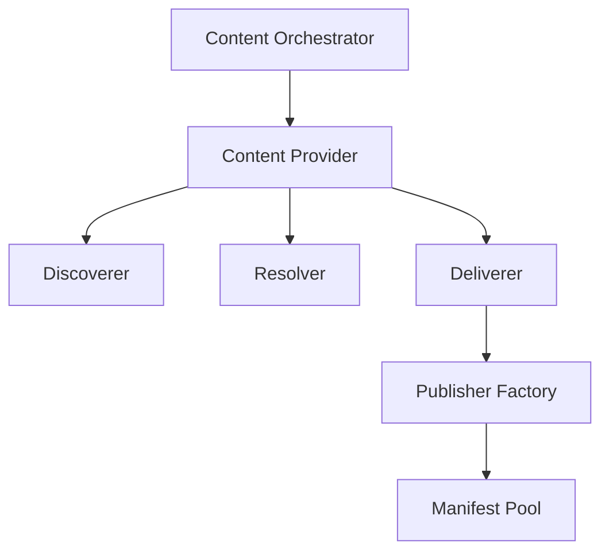

## Content Features

The GenHub content system provides a flexible, extensible architecture for discovering, acquiring, and managing game content from various sources.

## Core Documentation

- [Content Pipeline Architecture](./content-pipeline.md) - Three-tier pipeline for discovering, resolving, and acquiring content
- [Provider Configuration](./provider-configuration.md) - Data-driven provider configuration for flexible content pipeline customization
- [Publisher Manifest Factories](./publisher-manifest-factories.md) - Extensible architecture for publisher-specific content handling
- [Content Dependencies](./content-dependencies.md) - Dependency system for mods and content packages
- [Downloads Flow](../FlowCharts/Downloads-Flow.md) - User journey from browsing to installation

## Architecture

The content system follows a layered architecture with clear separation of concerns:

1. **Content Orchestrator**: Coordinates all content operations
2. **Content Providers**: Publisher-specific facades (GitHub, CNCLabs, AODMaps, ModDB, Community Outpost)
3. **Pipeline Components**:
   - **Discoverers**: Find available content
   - **Resolvers**: Transform lightweight results into full manifests
   - **Deliverers**: Download and extract content files
4. **Publisher Factories**: Handle publisher-specific manifest generation
5. **Provider Configuration**: Data-driven JSON-based settings (see [Provider Configuration](./provider-configuration.md))

## Key Features

### Multi-Source Content Support

- GitHub releases
- CNCLabs maps
- AODMaps (Age of Defense Maps)
- Community Outpost (GenPatcher)
- ModDB (mods, addons, patches, maps, skins, videos, modding tools)
- Local file system
- Future: Steam Workshop

### Publisher-Agnostic Architecture

- Factory pattern for extensibility
- Support for any publisher without code changes
- Support for all content types (GameClient, Mod, Patch, Addon, etc.)

### Multi-Variant Content

- Single release can generate multiple manifests
- Example: TheSuperHackers releases → Generals + Zero Hour manifests
- Example: GeneralsOnline releases → 30Hz + 60Hz variants

### Content Types

- GameClient: Complete game executables
- Mod: Game modifications
- Patch: Bug fixes and updates
- Addon: Additional content packs
- MapPack: Map collections
- LanguagePack: Translation files
- Mission: Campaign missions
- Map: Individual maps
- ModdingTool: Standalone modding utilities and tools
- ContentBundle: Meta-packages

## Content Pipeline



### Discovery Phase

- Scan configured sources for available content
- Return lightweight search results

### Resolution Phase

- Transform search results into full ContentManifests
- Fetch detailed metadata from APIs
- Build manifest structures

### Delivery Phase

- Download content files
- Extract archives
- Use factory to generate manifests
- Store to content pool

## Publisher Factory System

The Publisher Manifest Factory pattern enables extensible content handling:

### Key Components

1. **IPublisherManifestFactory**: Interface for factory implementations
2. **SuperHackersManifestFactory**: Handles multi-game releases
3. **ModDBManifestFactory**: Handles ModDB content with date-based versioning
4. **PublisherManifestFactoryResolver**: Selects appropriate factory

### Factory Selection

Factories self-identify via `CanHandle(manifest)`:

- SuperHackers GameClient → SuperHackersManifestFactory
- ModDB content (mods, addons, patches, maps, etc.) → ModDBManifestFactory
- Custom publishers → Custom factories (when implemented)

### Benefits

✅ Add new publishers without modifying core code
✅ Support complex release structures (multi-game, multi-variant)
✅ Isolate publisher-specific logic
✅ Easy testing with mock factories

See [Publisher Manifest Factories](./publisher-manifest-factories.md) for detailed documentation.

## Content Storage

Content is stored in the **Content Pool**:

- Manifest files stored separately from content files
- Deterministic ManifestId generation
- Hash-based validation
- Duplicate detection
- Content caching for parsed web pages (ContentCacheService)

## Integration Points

### Game Profiles

- Profiles reference content via ManifestId
- Content acquired on-demand during profile setup
- Automatic dependency resolution

### Workspace System

- Content deployed to workspace directories
- Strategy-based file management
- Isolation between profiles

### Launching System

- Launcher resolves content references
- Validates content integrity
- Launches with correct executable

## Adding Publisher Support

To add support for a new publisher:

1. Create factory class implementing `IPublisherManifestFactory`
2. Implement `CanHandle()` to identify your publisher
3. Implement `CreateManifestsFromExtractedContentAsync()` for manifest generation
4. Register factory in `ContentPipelineModule.cs`

**Zero changes required to:**

- GitHubContentDeliverer
- Content orchestrator
- Other factories

See [Publisher Manifest Factories - Adding Support](./publisher-manifest-factories.md#adding-support-for-new-publishers) for step-by-step guide.

## Implemented Content Providers

### ModDB Provider

The ModDB content provider enables discovery and acquisition of game content from ModDB.com:

**Capabilities:**

- **Content Types**: Mods, patches, maps, addons, skins, videos, modding tools, language packs
- **Discovery**: Playwright-based browser automation to bypass WAF/bot protections
- **Parsing**: AngleSharp-based HTML parser for extracting rich content metadata
- **Multi-Section Support**: Searches both Downloads and Addons sections
- **Rich Metadata**: Extracts files, videos, images, articles, reviews, and comments

**Architecture:**

- **ModDBDiscoverer**: Uses Playwright to fetch listing pages with browser automation
- **ModDBPageParser**: Universal web page parser supporting multiple page types (detail, list, file detail)
- **ModDBResolver**: Transforms discovered items into content manifests using parsed data
- **ModDBManifestFactory**: Generates manifest IDs with release-date versioning (format: `1.YYYYMMDD.moddb-{author}.{contentType}.{contentName}`)

**Key Features:**

- WAF bypass using headless Chromium browser
- Separate manifest creation for each file based on FileSectionType
- Release date extraction for accurate version tracking
- Support for ModDB's pagination and filtering (category, license, timeframe)
- Content caching to avoid repeated web fetches

### Provider Comparison

| Provider | Content Types | Discovery Method | Versioning | Factory |
| :--- | :--- | :--- | :--- | :--- |
| GitHub | Mods, GameClients, Patches | API | Semantic (tags) | GitHubManifestFactory |
| CNCLabs | Maps | Web scraping | Date-based | CNCLabsManifestFactory |
| AODMaps | Maps | Web scraping | Date-based | AODMapsManifestFactory |
| ModDB | Mods, Addons, Patches, Maps, Skins, Videos, Tools | Playwright + AngleSharp | Date-based (YYYYMMDD) | ModDBManifestFactory |
| Community Outpost | Patches | API | Semantic | CommunityOutpostFactory |

## Downloads UI Integration

The content pipeline directly feeds the Downloads browser, enabling users to discover, install, and manage game content.

### Content State Service

The **ContentStateService** determines the current state of content for UI display:

- **NotDownloaded**: Content has not been downloaded. Show "Download" button
- **UpdateAvailable**: Content exists locally but a newer version is available. Show "Update" button
- **Downloaded**: Content is downloaded and up-to-date. Show "Add to Profile" dropdown

**State Detection:**

- Generates prospective manifest IDs using `ManifestIdGenerator`
- Checks manifest pool for exact matches
- Searches for older versions by comparing publisher, content type, and content name
- Uses release date (yyyyMMdd) for version comparison

### Manifest ID Generation

The **ManifestIdGenerator** creates deterministic, human-readable manifest IDs following a 5-segment format:

```text
schemaVersion.userVersion.publisher.contentType.contentName
```

**Examples:**

- `1.20240315.moddb-westwood.mod.contra` (ModDB content with date versioning)
- `1.0.themodders.gameclient.generals` (Publisher content with semantic versioning)
- `1.108.ea.gameinstallation.zerohour` (Game installation)

**Benefits:**

- Consistent parsing and validation across the system
- Hierarchical organization for efficient querying
- Unique identification across publishers and content types
- Schema versioning support for future format evolution
- Human-readable format for debugging and logging

### Profile Selection Integration

The Downloads UI integrates with the game profile system:

- Users can add downloaded content to specific game profiles
- Profile selection dropdown shown for downloaded content
- Content references stored in profile configuration via ManifestId
- Automatic dependency resolution during profile setup

### Content Acquisition Flow

1. **Discovery**: Users browse content from various providers (GitHub, ModDB, CNCLabs, etc.)
2. **Resolution**: Selecting content triggers resolution to full manifest
3. **State Check**: ContentStateService determines current state (NotDownloaded/UpdateAvailable/Downloaded)
4. **Acquisition**: Download/update triggers content pipeline execution
5. **Profile Assignment**: Users assign content to game profiles for deployment

## Future Enhancements

- [ ] Steam Workshop integration
- [ ] Automatic content updates
- [ ] Content dependency resolution
- [ ] Multi-language support
- [ ] Content rating/review system
