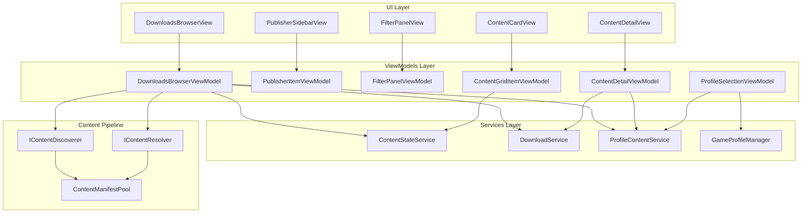
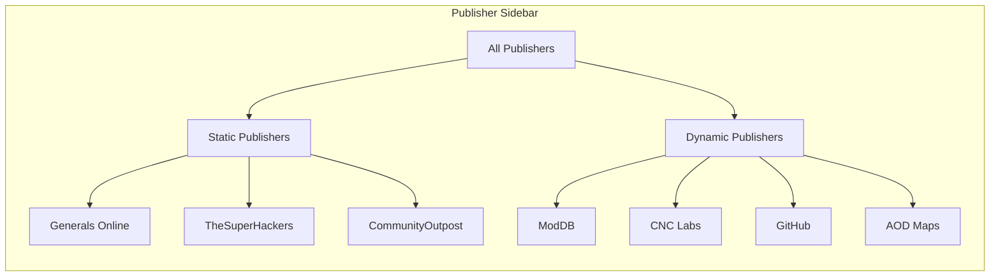
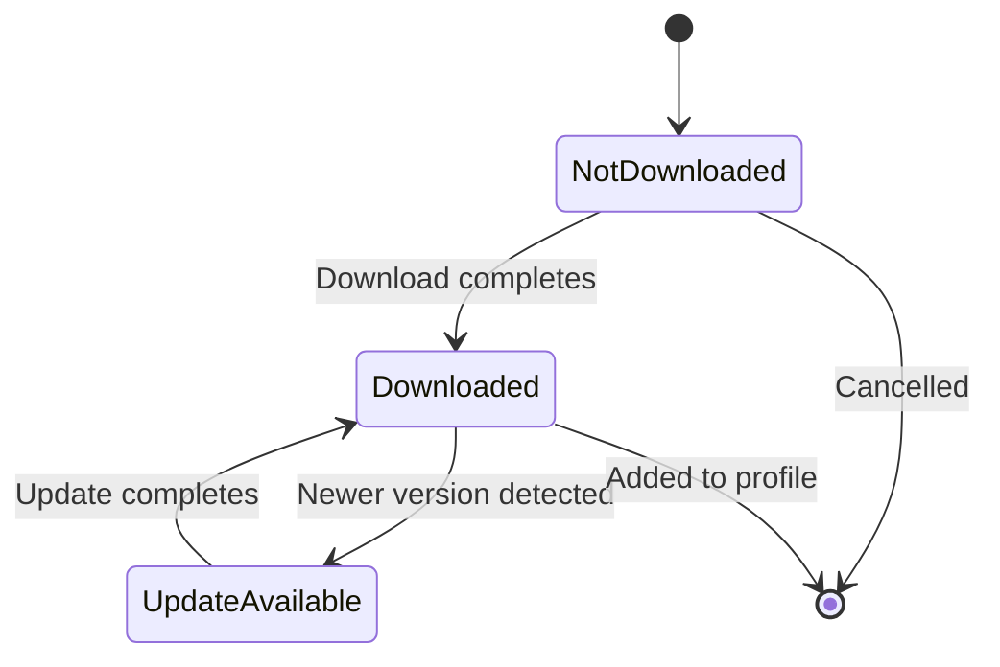
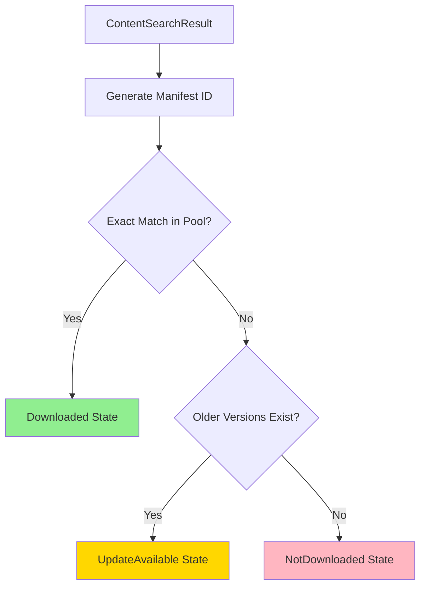
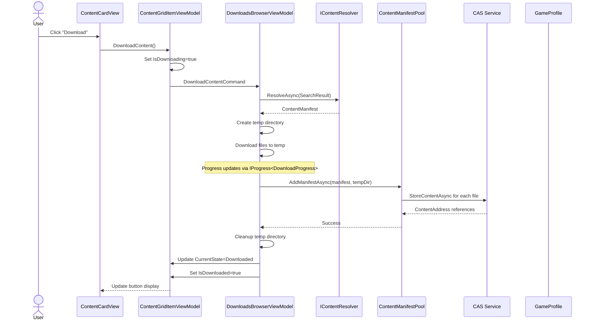
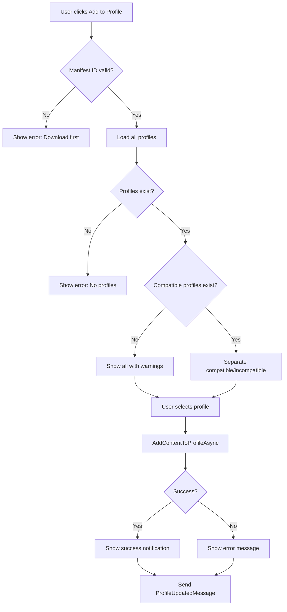
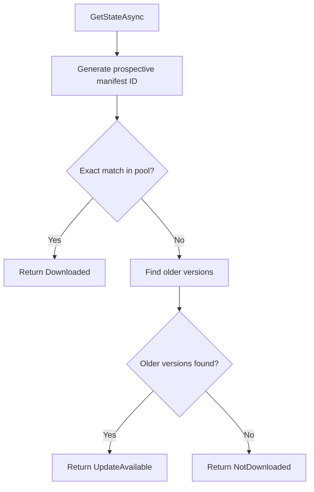
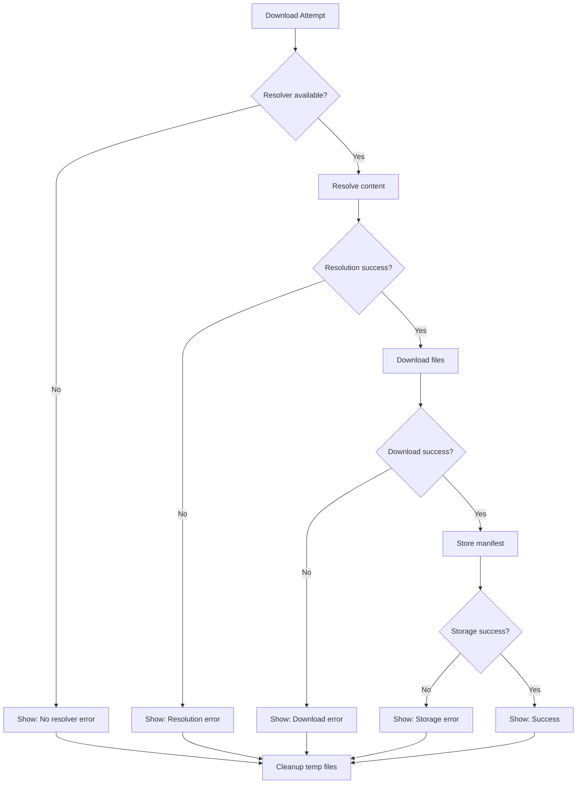

## Downloads Browser

The Downloads browser is GenHub's unified content discovery and acquisition interface. It provides a user-friendly way to browse, discover, download, and install game content from multiple publishers through a single, cohesive interface.

## Overview

The Downloads browser serves as the primary entry point for users to discover and acquire game content including mods, maps, patches, tools, and more. It integrates with GenHub's content pipeline to provide seamless access to content from various publishers.

### Key Features

- **Multi-publisher support**: Browse content from multiple sources in one interface
- **Publisher-specific filters**: Each publisher provides customized filtering options
- **Smart content state management**: Tracks download status and update availability
- **Profile integration**: Add downloaded content directly to game profiles
- **Detailed content view**: Rich content information with screenshots, videos, and reviews
- **Lazy loading**: Optimized performance through on-demand content loading

## Architecture

The Downloads browser follows the Model-View-ViewModel (MVVM) pattern and integrates with GenHub's content pipeline through several key components:



### Component Responsibilities

| Component | Responsibility |
| :--- | :--- |
| `DownloadsBrowserViewModel` | Main coordinator for the browser, handles publisher selection, content discovery, and navigation |
| `ContentGridItemViewModel` | Represents individual content items in the grid, manages display state |
| `ContentDetailViewModel` | Displays detailed content information with rich media, handles downloads |
| `ProfileSelectionViewModel` | Manages profile selection with smart compatibility filtering |
| `ContentStateService` | Determines if content is downloaded, update available, or not downloaded |
| `IContentDiscoverer` | Discovers content from publisher sources |
| `IContentResolver` | Resolves content into manifests for storage |

## UI Components

### Publisher Sidebar

The left sidebar displays all available content publishers, categorized as **static** (official GenHub partners) or **dynamic** (community sources).



#### Static Publishers

Static publishers are official GenHub content sources with curated content:

| Publisher | Type | Content Focus |
| :--- | :--- | :--- |
| **Generals Online** | Static | Community game client |
| **TheSuperHackers** | Static | Game patches and utilities |
| **CommunityOutpost** | Static | GenPatcher and community tools |

#### Dynamic Publishers

Dynamic publishers are community-driven sources with dynamically discovered content:

| Publisher | Type | Content Focus |
| :--- | :--- | :--- |
| **ModDB** | Dynamic | Mods, addons, maps, tools |
| **CNC Labs** | Dynamic | Maps and missions |
| **GitHub** | Dynamic | Project releases and topics |
| **AOD Maps** | Dynamic | Art of Defense maps |

### Filter Panels

Each publisher provides a specialized filter panel (`IFilterPanelViewModel`) that implements publisher-specific filtering logic:

#### ModDB Filter Panel

The ModDB filter supports section-based filtering with extensive category options:

```csharp
// Section selection
public enum ModDBSection
{
    Downloads,  // Full game downloads and patches
    Mods,       // Game modifications
    Addons      // Addons for mods
}

// Filter categories
- Category: Releases, Full Version, Demo, Patch, Tools, Media, etc.
- Addon Category: Maps, Models, Skins, Audio, Graphics, etc.
- License: BSD, MIT, GPL, Creative Commons, etc.
- Timeframe: Past 24 hours, week, month, year, or older
```

#### CNC Labs Filter Panel

The CNC Labs filter provides map-specific filtering:

```csharp
// Content type filtering
- ContentType: Map, Mission

// Game filtering
- TargetGame: Generals, Zero Hour

// Player count filtering
- NumberOfPlayers: 1-6 players, or Any

// Map tag filtering (toggle-based)
- Layout: Cramped, Spacious, Symmetric, Asymmetric
- Quality: Well Balanced, Detailed
- Economy: Money Map
- Features: Custom Scripted, Custom Coded
- Difficulty: Noob Friendly, Veteran Suitable
- Mode: Art of Defense, Art of Attack, Coop Mission, Multiplayer Only
- Style: Fun Map
- Type: Shell Map, Ported Mission to ZH
```

#### GitHub Filter Panel

Basic filtering for GitHub repositories and releases:

```csharp
// Repository and release type filtering
- Sort options: Recent, Popular, etc.
- Release type filtering
```

#### AOD Maps Filter Panel

Specialized filtering for Art of Defense maps:

```csharp
// Map type and difficulty filtering
- Map type categories
- Difficulty levels
```

#### Static Publisher Filter Panel

Minimal filtering for static publishers:

```csharp
// Basic content type and game filtering
- ContentType: All types supported by publisher
- TargetGame: Generals, Zero Hour
```

### Content Grid

The main content area displays content cards in a responsive grid layout. Each card shows:

- Content icon/thumbnail
- Content name
- Short description (truncated to 150 characters)
- Author name
- Last updated date
- Download size (if available)
- Content state badge (Not Downloaded, Update Available, Downloaded)
- Action buttons (Download, Update, Add to Profile)

#### Content Card States



### Content Detail View

Clicking a content card opens the detailed content view with tabbed information:

| Tab | Content | Lazy Loaded |
| :--- | :--- | :--- |
| **Overview** | Description, metadata, tags, screenshots | No |
| **Images** | Additional images from parsed page | Yes |
| **Videos** | Video content | Yes |
| **Releases** | Downloadable files/releases | Yes |
| **Addons** | Related addons | Yes |
| **Reviews** | User reviews | No |
| **Comments** | User comments | No |

#### Detail View Features

- **Screenshot gallery**: Visual content preview with full-size viewing
- **Rich text description**: Formatted content from parsed web pages
- **Download progress**: Real-time download progress with status messages
- **Release management**: Multiple release versions with individual download actions
- **Addon support**: Browse and download related addons
- **Profile integration**: Add content directly to compatible profiles

## State Management

### ContentStateService

The `ContentStateService` determines the current state of content for UI display:

```csharp
public enum ContentState
{
    NotDownloaded,    // Show "Download" button
    UpdateAvailable,  // Show "Update" button
    Downloaded        // Show "Add to Profile" button
}
```

#### State Determination Logic



#### Manifest ID Generation

Manifest IDs are generated using the `ManifestIdGenerator`:

```csharp
// Format: {schemaVersion}.{userVersion}.{publisher}.{contentType}.{contentName}
// Example: 1.0.20240115.moddb.Mod.Shockwave

var manifestId = ManifestIdGenerator.GeneratePublisherContentId(
    publisher: "moddb",
    contentType: ContentType.Mod,
    contentName: "Shockwave",
    releaseDate: new DateTime(2024, 1, 15)
);
// Result: "1.0.20240115.moddb.Mod.Shockwave"
```

The `userVersion` segment (second component) is the release date in `yyyyMMdd` format, enabling:

- Version comparison (string comparison works for date-based versions)
- Update detection (newer date = update available)
- Multiple version support

### Button Visibility Logic

The visibility of action buttons is determined by the content state:

```csharp
// ContentGridItemViewModel
public bool ShowDownloadButton => CurrentState == ContentState.NotDownloaded;
public bool ShowUpdateButton => CurrentState == ContentState.UpdateAvailable;
public bool ShowAddToProfileButton => CurrentState == ContentState.Downloaded;

// Command availability
public bool CanDownload => !IsDownloaded && !IsDownloading && CurrentState != ContentState.Downloaded;
public bool CanAddToProfile => IsDownloaded && !IsDownloading;
```

## Download Flow

The download process follows a multi-stage pipeline from user click to CAS storage:



### Download Stages

#### 1. Resolution Stage

```csharp
// Get the appropriate resolver for the publisher
var resolver = resolvers.FirstOrDefault(r =>
    r.ResolverId.Equals(item.ProviderName, StringComparison.OrdinalIgnoreCase));

// Resolve the search result into a full manifest
var manifestResult = await resolver.ResolveAsync(item.SearchResult, cancellationToken);
```

#### 2. Download Stage

```csharp
// Filter for remote files
var remoteFiles = manifest.Files
    .Where(f => f.SourceType == ContentSourceType.RemoteDownload)
    .ToList();

// Download each file with progress reporting
foreach (var file in remoteFiles)
{
    var downloadResult = await downloadService.DownloadFileAsync(
        new Uri(file.SourcePath),
        targetPath,
        null,
        new Progress<DownloadProgress>(p =>
        {
            // Update UI progress
            item.DownloadProgress = (int)p.Percentage;
        }),
        cancellationToken);
}
```

#### 3. Storage Stage

```csharp
// Store manifest in the pool with files from temp directory
var addResult = await manifestPool.AddManifestAsync(
    manifest,
    tempDir,
    null,
    cancellationToken);

// Cleanup temp directory
if (Directory.Exists(tempDir))
{
    Directory.Delete(tempDir, true);
}
```

### State Transitions

The download process triggers state transitions:

1. **Initial State**: `NotDownloaded` → Shows "Download" button
2. **Downloading**: `IsDownloading = true` → Shows progress indicator
3. **Complete**: `Downloaded` → Shows "Add to Profile" button
4. **Update Available**: `UpdateAvailable` → Shows "Update" button (when newer version detected)

## Add to Profile Flow

After content is downloaded, users can add it to a game profile through the `ProfileSelectionViewModel`:



### Smart Filtering

The profile selection uses smart filtering to categorize profiles by compatibility:

```csharp
// Compatibility check
private bool IsCompatible(GameProfile profile, GameType targetGame)
{
    // ZeroHour content can only go in ZeroHour profiles
    // Generals content can only go in Generals profiles
    return profile.GameClient.GameType == targetGame;
}

// Categorize profiles
foreach (var profile in profiles)
{
    if (IsCompatible(profile, targetGame))
    {
        CompatibleProfiles.Add(option);
    }
    else
    {
        option.ShowWarning = true;
        option.WarningMessage = $"This profile is for {profile.GameClient.GameType}, " +
                              $"content is for {targetGame}";
        OtherProfiles.Add(option);
    }
}
```

### Profile Selection UI

The profile selection dialog displays:

- **Compatible profiles** (no warnings)
- **Incompatible profiles** (with warning messages explaining the mismatch)
- **Create new profile** option (automatically creates profile with content pre-enabled)

### Dependency Resolution

When adding content to a profile:

```csharp
// Add content with automatic dependency handling
var result = await profileContentService.AddContentToProfileAsync(
    profileId,
    manifestId,
    cancellationToken);

// Handle content swap (if content type allows only one instance)
if (result.WasContentSwapped)
{
    logger.LogInformation(
        "Content swap: replaced {OldContent} with {NewContent} in profile {ProfileName}",
        result.SwappedContentName,
        contentName,
        profileName);
}
```

## Supported Publishers

### Publisher Capabilities

| Publisher | Content Types | Filters | Discoverer | Resolver |
| :--- | :--- | :--- | :--- | :--- |
| **ModDB** | Mods, Addons, Maps, Tools, Patches | Category, Addon, License, Timeframe | `ModDBDiscoverer` | `ModDBResolver` |
| **CNC Labs** | Maps, Missions | Game, Players, Tags | `CNCLabsMapDiscoverer` | `CNCLabsResolver` |
| **GitHub** | All types | Repository, Release type | `GitHubReleasesDiscoverer`, `GitHubTopicsDiscoverer` | `GitHubResolver` |
| **AOD Maps** | Maps | Map type, Difficulty | `AODMapsDiscoverer` | `AODMapsResolver` |
| **Generals Online** | GameClient, Tools | Basic | `GeneralsOnlineDiscoverer` | `GeneralsOnlineResolver` |
| **TheSuperHackers** | GameClient, Patches | Basic | `GitHubReleasesDiscoverer` | `SuperHackersManifestFactory` |
| **CommunityOutpost** | Tools, Patches | Type | `CommunityOutpostDiscoverer` | `CommunityOutpostResolver` |

### Publisher Constants

All publishers use constant identifiers from `PublisherTypeConstants`:

```csharp
public static class PublisherTypeConstants
{
    public const string All = "all";
    public const string ModDB = "moddb";
    public const string CncLabs = "cnclabs";
    public const string GitHub = "github";
    public const string AODMaps = "aodmaps";
    public const string GeneralsOnline = "generalsonline";
    public const string TheSuperHackers = "thesuperhackers";
    public const string CommunityOutpost = "communityoutpost";
}
```

## Extensibility

### Adding a New Publisher

To add support for a new publisher to the Downloads browser:

#### 1. Define Publisher Constants

```csharp
// In GenHub.Core/Constants/YourPublisherConstants.cs
public static class YourPublisherConstants
{
    public const string PublisherType = "yourpublisher";
    public const string ContentTypeMaps = "maps";
    // Add other constants...
}
```

Add to `PublisherTypeConstants`:

```csharp
public static class PublisherTypeConstants
{
    // Existing publishers...
    public const string YourPublisher = "yourpublisher";
}
```

#### 2. Implement Discoverer

```csharp
using GenHub.Core.Interfaces.Content;
using GenHub.Core.Models.Content;
using GenHub.Core.Models.Results.Content;

public class YourPublisherDiscoverer : IContentDiscoverer
{
    public bool IsEnabled => true;
    public string SourceName => PublisherTypeConstants.YourPublisher;

    public async Task<OperationResult<ContentDiscoveryResult>> DiscoverAsync(
        ContentSearchQuery query,
        CancellationToken cancellationToken)
    {
        // Implement discovery logic
        var items = new List<ContentSearchResult>();

        // Fetch content from your source
        // Create ContentSearchResult for each item

        return OperationResult<ContentDiscoveryResult>.Success(
            new ContentDiscoveryResult
            {
                Items = items,
                TotalCount = items.Count,
                HasMoreItems = false
            });
    }
}
```

#### 3. Implement Resolver

```csharp
using GenHub.Core.Interfaces.Content;
using GenHub.Core.Models.Manifest;
using GenHub.Core.Models.Results.Content;

public class YourPublisherResolver : IContentResolver
{
    public string ResolverId => PublisherTypeConstants.YourPublisher;

    public async Task<OperationResult<ContentManifest>> ResolveAsync(
        ContentSearchResult searchResult,
        CancellationToken cancellationToken)
    {
        // Implement resolution logic
        // Create ContentManifest with files

        var manifest = new ContentManifestBuilder()
            .WithBasicInfo(...)
            .WithMetadata(...)
            .AddDownloadedFileAsync(url, ...)
            .Build();

        return OperationResult<ContentManifest>.Success(manifest);
    }
}
```

#### 4. Create Filter ViewModel

```csharp
using GenHub.Features.Downloads.ViewModels.Filters;

public partial class YourPublisherFilterViewModel : FilterPanelViewModelBase
{
    public override string PublisherId => PublisherTypeConstants.YourPublisher;

    [ObservableProperty]
    private string? _selectedCategory;

    public ObservableCollection<FilterOption> CategoryOptions { get; } = [];

    public override bool HasActiveFilters => !string.IsNullOrEmpty(SelectedCategory);

    public override ContentSearchQuery ApplyFilters(ContentSearchQuery baseQuery)
    {
        if (!string.IsNullOrEmpty(SelectedCategory))
        {
            baseQuery.YourPublisherCategory = SelectedCategory;
        }
        return baseQuery;
    }

    public override void ClearFilters()
    {
        SelectedCategory = null;
        NotifyFiltersChanged();
        OnFiltersCleared();
    }

    public override IEnumerable<string> GetActiveFilterSummary()
    {
        if (!string.IsNullOrEmpty(SelectedCategory))
        {
            yield return $"Category: {SelectedCategory}";
        }
    }
}
```

#### 5. Register in DownloadsBrowserViewModel

```csharp
// In InitializePublishers()
Publishers.Add(
    new PublisherItemViewModel(
        PublisherTypeConstants.YourPublisher,
        "Your Publisher",
        "avares://GenHub/Assets/Logos/yourpublisher-logo.png",
        "dynamic"));

// In InitializeFilterViewModels()
_filterViewModels[PublisherTypeConstants.YourPublisher] =
    new YourPublisherFilterViewModel();

// In GetDiscovererForPublisher()
case PublisherTypeConstants.YourPublisher =>
    contentDiscoverers.OfType<YourPublisherDiscoverer>().FirstOrDefault(),
```

#### 6. Register Services

In `GenHub/Infrastructure/DependencyInjection/ContentPipelineModule.cs`:

```csharp
// Register discoverer
services.AddSingleton<IContentDiscoverer, YourPublisherDiscoverer>();

// Register resolver
services.AddSingleton<IContentResolver, YourPublisherResolver>();
```

### Extending Filter Queries

Add publisher-specific query properties to `ContentSearchQuery`:

```csharp
public class ContentSearchQuery
{
    // Existing properties...

    // Your publisher filters
    public string? YourPublisherCategory { get; set; }
    public string? YourPublisherCustomFilter { get; set; }
}
```

### Custom Manifest Factories

For publishers with special manifest generation requirements:

```csharp
using GenHub.Core.Interfaces.Content;

public class YourPublisherManifestFactory : IPublisherManifestFactory
{
    public bool CanHandle(ContentManifest manifest)
    {
        // Identify your publisher's manifests
        return manifest.Metadata?.Publisher ==
            PublisherTypeConstants.YourPublisher;
    }

    public async Task<OperationResult<IEnumerable<ContentManifest>>> CreateManifestsFromExtractedContentAsync(
        string extractionDirectory,
        ContentManifest originalManifest,
        CancellationToken cancellationToken)
    {
        // Custom manifest generation logic
        var manifests = new List<ContentManifest>();

        // Create specialized manifests for your content

        return OperationResult<IEnumerable<ContentManifest>>.Success(manifests);
    }
}
```

## ViewModels Reference

### DownloadsBrowserViewModel

**Location**: `GenHub/Features/Downloads/ViewModels/DownloadsBrowserViewModel.cs`

The main coordinator for the Downloads browser.

#### Key Properties

| Property | Type | Description |
| :--- | :--- | :--- |
| `Publishers` | `ObservableCollection<PublisherItemViewModel>` | Available content sources |
| `SelectedPublisher` | `PublisherItemViewModel` | Currently selected publisher |
| `ContentItems` | `ObservableCollection<ContentGridItemViewModel>` | Discovered content |
| `FilterViewModel` | `IFilterPanelViewModel` | Publisher-specific filters |
| `SelectedContent` | `ContentDetailViewModel` | Currently viewing content details |
| `IsLoading` | `bool` | Content discovery in progress |
| `CanLoadMore` | `bool` | More pages available |
| `CurrentPage` | `int` | Current pagination page |
| `PageSize` | `int` | Items per page (default: 24) |

#### Key Commands

| Command | Description |
| :--- | :--- |
| `SelectPublisherCommand` | Switches to selected publisher |
| `SearchCommand` | Executes search with current filters |
| `LoadMoreCommand` | Loads next page of results |
| `ViewContentCommand` | Opens content detail view |
| `CloseDetailCommand` | Closes content detail view |
| `DownloadContentCommand` | Initiates content download |
| `AddContentToProfileCommand` | Adds content to profile |

### ContentGridItemViewModel

**Location**: `GenHub/Features/Downloads/ViewModels/ContentGridItemViewModel.cs`

Represents a content item in the grid.

#### ContentGrid Properties

| Property | Type | Description |
| :--- | :--- | :--- |
| `SearchResult` | `ContentSearchResult` | Underlying search result |
| `CurrentState` | `ContentState` | Download state |
| `IsDownloading` | `bool` | Download in progress |
| `IsDownloaded` | `bool` | Successfully downloaded |
| `DownloadProgress` | `int` | Progress 0-100 |
| `DownloadStatus` | `string` | Status message |
| `ShowDownloadButton` | `bool` | Show download button |
| `ShowUpdateButton` | `bool` | Show update button |
| `ShowAddToProfileButton` | `bool` | Show add to profile button |
| `Variants` | `ObservableCollection<InstallableVariant>` | Installable variants |
| `HasVariants` | `bool` | Multiple variants available |

### ContentDetailViewModel

**Location**: `GenHub/Features/Downloads/ViewModels/ContentDetailViewModel.cs`

Displays detailed content information.

#### ContentDetail Properties

| Property | Type | Description |
| :--- | :--- | :--- |
| `ParsedPage` | `ParsedWebPage` | Parsed web page data |
| `Screenshots` | `ObservableCollection<string>` | Screenshot URLs |
| `SelectedScreenshotUrl` | `string` | Currently selected screenshot |
| `Articles` | `ObservableCollection<Article>` | Article content |
| `Videos` | `ObservableCollection<Video>` | Video content |
| `Images` | `ObservableCollection<Image>` | Image content |
| `Files` | `ObservableCollection<WebFile>` | File listings |
| `Releases` | `ObservableCollection<ReleaseItemViewModel>` | Release items |
| `Addons` | `ObservableCollection<AddonItemViewModel>` | Addon items |
| `Reviews` | `ObservableCollection<Review>` | User reviews |
| `Comments` | `ObservableCollection<Comment>` | User comments |
| `HasReleases` | `bool` | Has releases to display |
| `HasAddons` | `bool` | Has addons to display |
| `IsDownloading` | `bool` | Download in progress |
| `IsDownloaded` | `bool` | Successfully downloaded |
| `IsUpdateAvailable` | `bool` | Update available |

#### Lazy Loading (Detail View)

The detail view implements lazy loading for optimal performance:

```csharp
// Lazy loaded tabs
[RelayCommand]
private async Task LoadImagesAsync() { /* Loads images tab */ }

[RelayCommand]
private async Task LoadVideosAsync() { /* Loads videos tab */ }

[RelayCommand]
private async Task LoadReleasesAsync() { /* Loads releases tab */ }

[RelayCommand]
private async Task LoadAddonsAsync() { /* Loads addons tab */ }
```

### ProfileSelectionViewModel

**Location**: `GenHub/Features/Downloads/ViewModels/ProfileSelectionViewModel.cs`

Manages profile selection with compatibility filtering.

#### ProfileSelection Properties

| Property | Type | Description |
| :--- | :--- | :--- |
| `CompatibleProfiles` | `ObservableCollection<ProfileOptionViewModel>` | Compatible profiles |
| `OtherProfiles` | `ObservableCollection<ProfileOptionViewModel>` | Incompatible profiles |
| `TargetGame` | `GameType` | Content's target game |
| `ContentManifestId` | `string` | Content to add |
| `ContentName` | `string` | Content name |
| `HasAnyProfiles` | `bool` | Any profiles available |
| `ProfileSummary` | `string` | Profile count summary |
| `IsLoading` | `bool` | Loading profiles |
| `ErrorMessage` | `string` | Error message |

#### ProfileSelection Commands

| Command | Description |
| :--- | :--- |
| `SelectProfileCommand` | Adds content to selected profile |
| `CreateNewProfileCommand` | Creates new profile with content |

## Services Reference

### IContentStateService

**Location**: `GenHub/Features/Downloads/Services/IContentStateService.cs`

Determines the current state of content for UI display.

```csharp
public interface IContentStateService
{
    Task<ContentState> GetStateAsync(ContentSearchResult item, CancellationToken cancellationToken = default);

    Task<ContentState> GetStateAsync(
        string publisher,
        ContentType contentType,
        string contentName,
        DateTime releaseDate,
        CancellationToken cancellationToken = default);

    Task<string?> GetLocalManifestIdAsync(ContentSearchResult item, CancellationToken cancellationToken = default);
}
```

### ContentStateService Implementation

**Location**: `GenHub/Features/Downloads/Services/ContentStateService.cs`

Implementation of content state detection.

#### State Detection Algorithm



## Content Pipeline Integration

The Downloads browser integrates with the content pipeline through:

### Content Discovery

```csharp
// Discover content from selected publisher
var discoverer = GetDiscovererForPublisher(publisherId);
var result = await discoverer.DiscoverAsync(query, cancellationToken);

// Result contains:
// - Items: List of ContentSearchResult
// - TotalCount: Total available items
// - HasMoreItems: Whether more pages exist
```

### Content Resolution

```csharp
// Resolve search result into manifest
var resolver = resolvers.FirstOrDefault(r =>
    r.ResolverId.Equals(item.ProviderName, StringComparison.OrdinalIgnoreCase));

var manifestResult = await resolver.ResolveAsync(item.SearchResult, cancellationToken);

// Result contains:
// - ContentManifest with metadata and files
// - Ready for storage in manifest pool
```

### Manifest Storage

```csharp
// Store manifest with files in CAS
var addResult = await manifestPool.AddManifestAsync(
    manifest,
    tempDirectory,
    null,
    cancellationToken);

// Manifest pool:
// - Stores files in CAS (Content Addressable Storage)
// - Creates manifest references to CAS content
// - Deduplicates identical files
// - Enables content sharing across profiles
```

## Error Handling

### Download Errors



### Error Messages

The Downloads browser provides user-friendly error messages:

| Error Type | Message |
| :--- | :--- |
| No resolver | "No resolver found for {publisher}" |
| Resolution failed | "Failed to resolve content: {error}" |
| Download failed | "Error downloading {filename}" |
| Storage failed | "Error: {error}" |
| Network error | "Network error: {error}" |
| No profiles | "No profiles available" |
| Incompatible profile | "This profile is for {profileGame}, content is for {contentGame}" |

## Performance Optimizations

### Lazy Loading Optimization

- **Content details**: Only loaded when tabs are accessed
- **Images/Videos**: Loaded on-demand when tabs open
- **Releases/Addons**: Populated when tab is selected

### Pagination

- **Page size**: 24 items per page
- **Load more**: Only loads additional pages when requested
- **Cancellation**: Previous searches are cancelled when new search starts

### Caching

- **Icon bitmaps**: Loaded and cached in ViewModels
- **Parsed pages**: Stored in SearchResult for reuse
- **Content states**: Cached by ContentStateService

### UI Responsiveness

- **Async operations**: All I/O is asynchronous
- **Progress updates**: Real-time download progress
- **State notifications**: PropertyChanged notifications for UI updates

## Accessibility

The Downloads browser follows accessibility best practices:

- **Keyboard navigation**: Full keyboard support for all actions
- **Screen reader support**: Semantic markup and ARIA labels
- **High contrast**: Support for high contrast themes
- **Focus management**: Proper focus handling for dialogs and overlays
- **Error announcements**: Screen reader announcements for errors

## Related Documentation

- [Content System](./content/index.md) - Content pipeline architecture
- [Content Pipeline](./content/content-pipeline.md) - Three-tier pipeline details
- [Downloads Flow](../FlowCharts/Downloads-Flow.md) - User flow diagrams
- [Publisher Manifest Factories](./content/publisher-manifest-factories.md) - Extensible publisher handling
- [Content Dependencies](./content/content-dependencies.md) - Dependency system

## Future Enhancements

- [ ] Batch download multiple items
- [ ] Download queue management
- [ ] Automatic update detection and notifications
- [ ] Content rating/review integration
- [ ] Advanced search with full-text filtering
- [ ] Content favorites/bookmarks
- [ ] Download history
- [ ] Cloud sync for downloaded content
- [ ] Content preview (in-app screenshots/videos)
- [ ] User-generated content uploads
