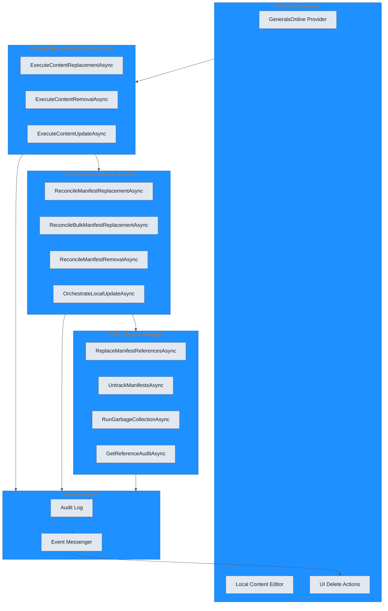
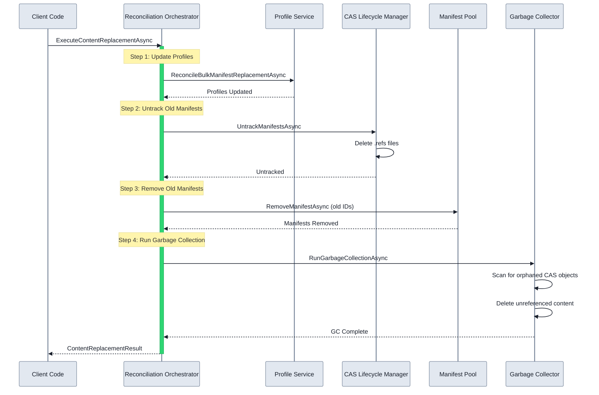

The Unified GameProfile Reconciler Infrastructure provides a comprehensive, atomic system for managing content updates across game profiles while ensuring Content Addressable Storage (CAS) lifecycle integrity. This system coordinates profile metadata updates, manifest replacements, and garbage collection in the correct execution order to prevent data loss and ensure system consistency.

## Overview

Content reconciliation is the process of synchronizing game profiles when content changes. When a manifest is updated, replaced, or removed, all profiles referencing that content must be updated to maintain consistency. The reconciler infrastructure provides:

- **Atomic Operations**: Multi-step operations either complete entirely or roll back
- **Correct Execution Order**: Profile updates must happen before CAS untracking, which must happen before garbage collection
- **Event Pipeline**: Real-time notifications for UI updates and user feedback
- **Audit Trail**: Complete history of all reconciliation operations for debugging and diagnostics

## Architecture

The reconciler infrastructure consists of five coordinated components:



## Core Components

### 1. Content Reconciliation Orchestrator

The `IContentReconciliationOrchestrator` is the single entry point for all reconciliation operations. It enforces the correct execution order and coordinates between services.

**Key Methods:**

```csharp
public interface IContentReconciliationOrchestrator
{
    // Complete content replacement workflow
    Task<OperationResult<ContentReplacementResult>> ExecuteContentReplacementAsync(
        ContentReplacementRequest request,
        CancellationToken cancellationToken = default);

    // Complete content removal workflow
    Task<OperationResult<ContentRemovalResult>> ExecuteContentRemovalAsync(
        IEnumerable<string> manifestIds,
        CancellationToken cancellationToken = default);

    // Local content update workflow
    Task<OperationResult<ContentUpdateResult>> ExecuteContentUpdateAsync(
        string oldManifestId,
        ContentManifest newManifest,
        CancellationToken cancellationToken = default);
}
```

### 2. CAS Lifecycle Manager

The `ICasLifecycleManager` manages CAS reference tracking and ensures garbage collection only runs after references are properly untracked.

**Key Methods:**

```csharp
public interface ICasLifecycleManager
{
    // Atomically replace manifest references (track new, then untrack old)
    Task<OperationResult> ReplaceManifestReferencesAsync(
        string oldManifestId,
        ContentManifest newManifest,
        CancellationToken cancellationToken = default);

    // Untrack references for specified manifest IDs
    Task<OperationResult<int>> UntrackManifestsAsync(
        IEnumerable<string> manifestIds,
        CancellationToken cancellationToken = default);

    // Run garbage collection (ONLY after all untrack operations complete)
    Task<OperationResult<GarbageCollectionStats>> RunGarbageCollectionAsync(
        bool force = false,
        CancellationToken cancellationToken = default);

    // Get audit of current CAS references
    Task<OperationResult<CasReferenceAudit>> GetReferenceAuditAsync(
        CancellationToken cancellationToken = default);
}
```

### 3. Content Reconciliation Service

The `IContentReconciliationService` provides unified profile and manifest reconciliation, coordinating between profile metadata and CAS tracking.

**Key Methods:**

```csharp
public interface IContentReconciliationService
{
    // Reconcile profiles by replacing manifest references
    Task<OperationResult<int>> ReconcileManifestReplacementAsync(
        string oldId,
        string newId,
        CancellationToken cancellationToken = default);

    // Bulk reconciliation for multiple manifest replacements
    Task<OperationResult<int>> ReconcileBulkManifestReplacementAsync(
        IReadOnlyDictionary<string, string> replacements,
        CancellationToken cancellationToken = default);

    // Reconcile profiles by removing manifest references
    Task<OperationResult<int>> ReconcileManifestRemovalAsync(
        string manifestId,
        CancellationToken cancellationToken = default);

    // High-level orchestration for local content updates
    Task<OperationResult> OrchestrateLocalUpdateAsync(
        string oldId,
        ContentManifest newManifest,
        CancellationToken cancellationToken = default);
}
```

### 4. Event Pipeline

The event pipeline provides real-time notifications for UI updates and user feedback through the CommunityToolkit.Mvvm messaging system.

**Event Types:**

```csharp
// Raised when content is about to be removed
public record ContentRemovingEvent(
    string ManifestId,
    string? ManifestName,
    string Reason);

// Raised when reconciliation starts
public record ReconciliationStartedEvent(
    string OperationId,
    string OperationType,
    int ExpectedProfilesAffected,
    int ExpectedManifestsAffected);

// Raised when reconciliation completes
public record ReconciliationCompletedEvent(
    string OperationId,
    string OperationType,
    int ProfilesAffected,
    int ManifestsAffected,
    bool Success,
    string? ErrorMessage,
    TimeSpan Duration);

// Raised before garbage collection
public record GarbageCollectionStartingEvent(
    bool IsForced,
    int EstimatedOrphanedObjects);

// Raised after garbage collection
public record GarbageCollectionCompletedEvent(
    int ObjectsScanned,
    int ObjectsDeleted,
    long BytesFreed,
    TimeSpan Duration);

// Raised when a profile is updated
public record ProfileReconciledEvent(
    string ProfileId,
    string ProfileName,
    IReadOnlyList<string> OldManifestIds,
    IReadOnlyList<string> NewManifestIds);
```

### 5. Audit Trail

The `IReconciliationAuditLog` provides complete operation history for debugging and diagnostics.

**Key Methods:**

```csharp
public interface IReconciliationAuditLog
{
    // Log an operation to the audit trail
    Task LogOperationAsync(ReconciliationAuditEntry entry, CancellationToken cancellationToken = default);

    // Get recent audit history
    Task<IReadOnlyList<ReconciliationAuditEntry>> GetRecentHistoryAsync(
        int count = 50,
        CancellationToken cancellationToken = default);

    // Get history for a specific profile
    Task<IReadOnlyList<ReconciliationAuditEntry>> GetProfileHistoryAsync(
        string profileId,
        int count = 20,
        CancellationToken cancellationToken = default);

    // Get history for a specific manifest
    Task<IReadOnlyList<ReconciliationAuditEntry>> GetManifestHistoryAsync(
        string manifestId,
        int count = 20,
        CancellationToken cancellationToken = default);

    // Purge old entries beyond retention period
    Task<int> PurgeOldEntriesAsync(
        int retentionDays = 30,
        CancellationToken cancellationToken = default);
}
```

## Correct Execution Order

The reconciler enforces a strict execution order to prevent CAS garbage collection from deleting content that is still referenced:



### Why Order Matters

The execution order is critical for preventing data loss:

1. **Update Profiles First**: Profiles must be updated before CAS references are removed so that in-flight launches don't fail
2. **Untrack Before GC**: CAS reference files (`.refs`) must be deleted before garbage collection runs, otherwise the GC will see the content as still referenced
3. **Remove Manifests After Untrack**: Old manifests should be removed from the pool after untracking to maintain consistency
4. **GC Last**: Garbage collection must run last to ensure it has complete visibility of what content is actually unreferenced

## Operation Types

### Content Replacement

Replaces old manifest references with new ones across all profiles:

```csharp
var request = new ContentReplacementRequest
{
    ManifestMapping = new Dictionary<string, string>
    {
        ["generals-online-v1"] = "generals-online-v2"
    },
    RemoveOldManifests = true,
    RunGarbageCollection = true,
    Source = "GeneralsOnline"
};

var result = await orchestrator.ExecuteContentReplacementAsync(request, cancellationToken);

Console.WriteLine($"Updated {result.Data.ProfilesUpdated} profiles");
Console.WriteLine($"Removed {result.Data.ManifestsRemoved} manifests");
Console.WriteLine($"Collected {result.Data.CasObjectsCollected} CAS objects");
Console.WriteLine($"Freed {result.Data.BytesFreed} bytes");
```

**Execution Flow:**

1. Reconcile profiles with new manifest IDs
2. Untrack old manifests from CAS
3. Remove old manifest files from pool
4. Run garbage collection

### Content Removal

Removes content from all profiles and the system:

```csharp
var manifestIds = new[] { "outdated-mod", "deprecated-patch" };

var result = await orchestrator.ExecuteContentRemovalAsync(manifestIds, cancellationToken);

Console.WriteLine($"Updated {result.Data.ProfilesUpdated} profiles");
Console.WriteLine($"Removed {result.Data.ManifestsRemoved} manifests");
```

**Execution Flow:**

1. Remove manifest references from all profiles
2. Untrack manifests from CAS
3. Remove manifest files from pool
4. Run garbage collection

### Content Update

Updates local content with new manifest data:

```csharp
var newManifest = await CreateUpdatedManifestAsync(oldManifestId);

var result = await orchestrator.ExecuteContentUpdateAsync(
    oldManifestId,
    newManifest,
    cancellationToken);

Console.WriteLine($"ID changed: {result.Data.IdChanged}");
Console.WriteLine($"Updated {result.Data.ProfilesUpdated} profiles");
```

**Execution Flow:**

1. Track new manifest references (if ID changed)
2. Reconcile profiles or invalidate workspaces
3. Untrack old manifest (if ID changed)
4. Remove old manifest from pool (if ID changed)

## Result Models

All reconciliation operations return structured result types:

```csharp
// Result of content replacement
public record ContentReplacementResult
{
    public int ProfilesUpdated { get; init; }
    public int ManifestsRemoved { get; init; }
    public int CasObjectsCollected { get; init; }
    public long BytesFreed { get; init; }
    public TimeSpan Duration { get; init; }
    public IReadOnlyList<string> Warnings { get; init; }
}

// Result of content removal
public record ContentRemovalResult
{
    public int ProfilesUpdated { get; init; }
    public int ManifestsRemoved { get; init; }
    public int CasObjectsCollected { get; init; }
    public long BytesFreed { get; init; }
    public TimeSpan Duration { get; init; }
}

// Result of content update
public record ContentUpdateResult
{
    public bool IdChanged { get; init; }
    public int ProfilesUpdated { get; init; }
    public int WorkspacesInvalidated { get; init; }
    public TimeSpan Duration { get; init; }
}
```

## Audit Trail

Every reconciliation operation is logged to the audit trail with complete metadata:

```csharp
public record ReconciliationAuditEntry
{
    public required string OperationId { get; init; }
    public required ReconciliationOperationType OperationType { get; init; }
    public required DateTime Timestamp { get; init; }
    public string? Source { get; init; }
    public IReadOnlyList<string> AffectedProfileIds { get; init; }
    public IReadOnlyList<string> AffectedManifestIds { get; init; }
    public IReadOnlyDictionary<string, string>? ManifestMapping { get; init; }
    public bool Success { get; init; }
    public string? ErrorMessage { get; init; }
    public TimeSpan Duration { get; init; }
    public IReadOnlyDictionary<string, string>? Metadata { get; init; }
}
```

**Operation Types:**

- `ManifestReplacement`: Replacing manifest references in profiles
- `ManifestRemoval`: Removing manifest references from profiles
- `ProfileUpdate`: Updating a single profile
- `WorkspaceCleanup`: Cleaning up workspaces
- `CasUntrack`: Untracking CAS references
- `GarbageCollection`: Running garbage collection
- `LocalContentUpdate`: Local content update orchestration
- `GeneralsOnlineUpdate`: GeneralsOnline update orchestration

## Usage Examples

### GeneralsOnline Update

When GeneralsOnline provider updates its content:

```csharp
public async Task HandleGeneralsOnlineUpdateAsync(
    string oldVersion,
    string newVersion,
    CancellationToken cancellationToken)
{
    var mapping = new Dictionary<string, string>
    {
        [$"go-{oldVersion}"] = $"go-{newVersion}"
    };

    var request = new ContentReplacementRequest
    {
        ManifestMapping = mapping,
        RemoveOldManifests = true,
        RunGarbageCollection = true,
        Source = "GeneralsOnline"
    };

    var result = await _orchestrator.ExecuteContentReplacementAsync(
        request,
        cancellationToken);

    if (result.Success)
    {
        _logger.LogInformation(
            "GeneralsOnline update complete: {Profiles} profiles, {Bytes} bytes freed",
            result.Data.ProfilesUpdated,
            result.Data.BytesFreed);
    }
}
```

### Local Content Edit

When user edits local content:

```csharp
public async Task HandleLocalContentEditAsync(
    string manifestId,
    ContentManifest updatedManifest,
    CancellationToken cancellationToken)
{
    var result = await _orchestrator.ExecuteContentUpdateAsync(
        manifestId,
        updatedManifest,
        cancellationToken);

    if (result.Success)
    {
        _logger.LogInformation(
            "Local content updated: {IdChanged}, {Profiles} profiles affected",
            result.Data.IdChanged,
            result.Data.ProfilesUpdated);
    }
}
```

### Content Deletion

When user deletes content from the UI:

```csharp
public async Task HandleContentDeletionAsync(
    string manifestId,
    CancellationToken cancellationToken)
{
    var result = await _orchestrator.ExecuteContentRemovalAsync(
        new[] { manifestId },
        cancellationToken);

    if (result.Success)
    {
        _logger.LogInformation(
            "Content deleted: {Profiles} profiles updated, {Bytes} freed",
            result.Data.ProfilesUpdated,
            result.Data.BytesFreed);
    }
}
```

## Event Handling

UI components can subscribe to reconciliation events for real-time updates:

```csharp
// Subscribe to events
WeakReferenceMessenger.Default.Register<ReconciliationStartedEvent>(this, (r, m) =>
{
    UpdateStatus($"Reconciliation started: {m.OperationType}");
});

WeakReferenceMessenger.Default.Register<ReconciliationCompletedEvent>(this, (r, m) =>
{
    if (m.Success)
    {
        UpdateStatus($"Completed: {m.ProfilesAffected} profiles, {m.ManifestsAffected} manifests");
    }
    else
    {
        ShowError($"Failed: {m.ErrorMessage}");
    }
});

WeakReferenceMessenger.Default.Register<ProfileReconciledEvent>(this, (r, m) =>
{
    RefreshProfileCard(m.ProfileId);
});

WeakReferenceMessenger.Default.Register<GarbageCollectionCompletedEvent>(this, (r, m) =>
{
    UpdateStorageStats(m.ObjectsScanned, m.ObjectsDeleted, m.BytesFreed);
});
```

## Integration Points

### Profile Service

The reconciler integrates with `IGameProfileManager` for profile updates:

```csharp
var profilesResult = await _profileManager.GetAllProfilesAsync(cancellationToken);
var affectedProfiles = profilesResult.Data.Where(p =>
    p.EnabledContentIds?.Any(id => oldIds.Contains(id)) == true);

foreach (var profile in affectedProfiles)
{
    var newContentIds = profile.EnabledContentIds!
        .Select(id => replacements.TryGetValue(id, out var newId) ? newId : id)
        .ToList();

    await _profileManager.UpdateProfileAsync(profile.Id,
        new UpdateProfileRequest { EnabledContentIds = newContentIds },
        cancellationToken);
}
```

### Workspace Service

The reconciler integrates with `IWorkspaceManager` for workspace cleanup:

```csharp
// Clear workspace to force launch-time sync
if (!string.IsNullOrEmpty(profile.ActiveWorkspaceId))
{
    await _workspaceManager.CleanupWorkspaceAsync(
        profile.ActiveWorkspaceId,
        cancellationToken);
}
```

### CAS Service

The reconciler integrates with `ICasService` for garbage collection:

```csharp
var gcResult = await _casService.RunGarbageCollectionAsync(
    force: false,
    cancellationToken: cancellationToken);

var stats = gcResult.Data;
_logger.LogInformation(
    "GC complete: {Scanned} scanned, {Deleted} deleted, {Bytes} freed",
    stats.ObjectsScanned,
    stats.ObjectsDeleted,
    stats.BytesFreed);
```

## Related Documentation

- [Storage & CAS](./storage.md) - Content Addressable Storage architecture
- [Game Profiles](./gameprofiles) - Profile management system
- [Workspace Management](./workspace) - Workspace assembly and deltas
- [Architecture Overview](../architecture.md) - Complete system architecture

## Error Handling

The reconciler uses the `OperationResult<T>` pattern for consistent error handling:

```csharp
var result = await _orchestrator.ExecuteContentReplacementAsync(request, cancellationToken);

if (result.Success)
{
    // Handle success
    var data = result.Data;
}
else
{
    // Handle error
    _logger.LogError("Reconciliation failed: {Error}", result.FirstError);

    // Check for warnings
    foreach (var warning in data.Warnings)
    {
        _logger.LogWarning("Warning: {Warning}", warning);
    }
}
```

## Best Practices

1. **Always Use the Orchestrator**: Never call reconciler components directly. The orchestrator enforces correct execution order.

2. **Handle Warnings**: Operations may succeed with warnings (e.g., partial profile updates). Always check `Warnings` collection.

3. **Subscribe to Events**: UI components should subscribe to reconciliation events for real-time feedback.

4. **Check Audit Trail**: Use the audit log for debugging and diagnostics of failed operations.

5. **Respect Cancellation Tokens**: All reconciliation operations support cancellation for long-running operations.

6. **Profile Cleanup**: The reconciler automatically cleans up workspaces when profiles are updated to ensure launch-time synchronization.

7. **GC Timing**: Never run garbage collection directly. Let the orchestrator schedule it at the correct time.
