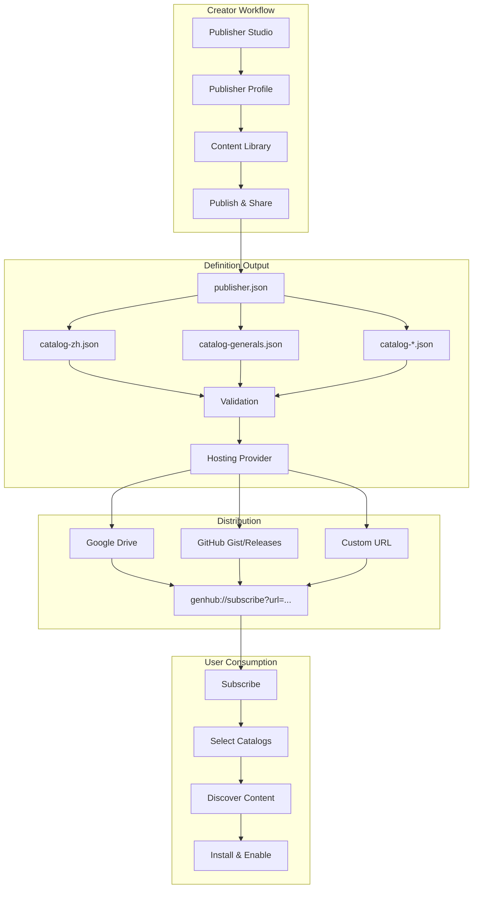

# Publisher Studio Documentation

> **Transform your content into a discoverable, subscribable catalog without writing a single line of JSON.**

## Table of Contents

- [Overview](#overview)
- [Quick Start Guide](#quick-start-guide)
- [User Guide](#user-guide)
  - [Getting Started](#getting-started)
  - [Step-by-Step Tutorials](#step-by-step-tutorials)
  - [Publishing Your Catalog](#publishing-your-catalog)
- [Best Practices](#best-practices)
- [Troubleshooting](#troubleshooting)
- [FAQ](#faq)
- [Technical Reference](#technical-reference)
- [Architecture](#architecture)

---

## Overview

The Publisher Studio is a comprehensive tool within GenHub that enables content creators to build, manage, and publish their own content catalogs without manual JSON editing. It integrates seamlessly with GenHub's decentralized content pipeline, allowing creators to host their catalogs anywhere and users to subscribe via simple `genhub://subscribe?url=...` links.

### What Can You Do?

- **Create Publisher Identity**: Set up your brand with name, avatar, website, and contact info
- **Manage Content Library**: Add mods, maps, addons, and other content with rich metadata
- **Version Management**: Track multiple releases with semantic versioning
- **Dependency Management**: Define cross-publisher dependencies with version constraints
- **Artifact Hosting**: Upload files directly to Google Drive (recommended), GitHub Releases, or provide custom URLs
- **Catalog Publishing**: Validate, export, and publish your catalog with stable URLs
- **Share & Distribute**: Generate subscription links for users to discover your content

### Who Is This For?

- **Mod Creators**: Share your mods with automatic updates and dependency management
- **Map Makers**: Publish map packs with screenshots and descriptions
- **Community Curators**: Curate collections of recommended content
- **Tool Developers**: Distribute standalone tools and utilities

---

## Quick Start Guide

### 5-Minute Setup

1. **Open Publisher Studio**
   - Navigate to Tools → Publisher Studio in GenHub
   - Click "Create New Project"

2. **Set Up Your Profile** (Publisher Profile Tab)
   - Publisher ID: `my-awesome-mods` (lowercase, alphanumeric, hyphens)
   - Display Name: `My Awesome Mods`
   - Add optional avatar, website, and support URLs
   - Click "Save Profile"

3. **Add Your First Content** (Content Library Tab)
   - Click "+ Add Content"
   - Fill in: Content ID, Name, Description
   - Select Content Type (Mod, Map, Addon, etc.)
   - Select Target Game (Zero Hour, Generals)
   - Click "Create Content"

4. **Create a Release**
   - Select your content item
   - Click "Add Release"
   - Version: `1.0.0` (semantic versioning)
   - Click "+ Add Artifact"
   - Provide download URL or upload file
   - Click "Create Release"

5. **Publish & Share** (Publish & Share Tab)
   - Click "Validate Catalog" (ensure ✓ Valid)
   - Click "Connect Google Drive" (recommended) or select another hosting provider
   - Click "Upload Catalog"
   - Copy the subscription link and share with users!

**Congratulations!** Users can now subscribe to your catalog using the `genhub://subscribe?url=...` link.

---

## User Guide

### Getting Started

#### Prerequisites

- GenHub installed and running
- Content files ready to publish (mods, maps, etc.)
- (Optional) Google account for Google Drive hosting (recommended, free)
- (Optional) GitHub account for GitHub hosting

#### Understanding the Workflow

The Publisher Studio workflow consists of three main stages:

1. **Profile Setup**: Define who you are as a publisher
2. **Content Management**: Add your mods, maps, and releases
3. **Publishing**: Validate, export, and share your catalog

Each stage is represented by a tab in the Publisher Studio interface.

---

### Step-by-Step Tutorials

#### Tutorial 1: Publishing Your First Mod

**Scenario**: You've created a mod called "Enhanced Units" and want to share it with the community.

**Step 1: Create Publisher Profile**

1. Open Publisher Studio (Tools → Publisher Studio)
2. Go to "Publisher Profile" tab
3. Fill in your details:

   ```
   Publisher ID: enhanced-mods
   Display Name: Enhanced Mods
   Website: https://github.com/yourusername
   Support URL: https://discord.gg/yourdiscord
   Email: contact@example.com
   ```

4. Click "Save Profile"

**Step 2: Add Content Item**

1. Go to "Content Library" tab
2. Click "+ Add Content"
3. Fill in the dialog:

   ```
   Content ID: enhanced-units
   Name: Enhanced Units
   Description: A comprehensive overhaul of all units with new abilities and balance changes.
   Content Type: Mod
   Target Game: Zero Hour
   Tags: gameplay, units, balance
   ```

4. Click "Create Content"

**Step 3: Create First Release**

1. Select "Enhanced Units" from the content list
2. Click "Add Release"
3. Fill in release details:

   ```
   Version: 1.0.0
   Release Date: [Today's date]
   Mark as latest: ✓
   Changelog:
   ## Version 1.0.0
   - Initial release
   - 50+ new unit abilities
   - Complete balance overhaul
   - New unit models and textures
   ```

**Step 4: Add Download Artifact**

1. Click "+ Add Artifact"
2. Choose one of two options:

   **Option A: I already have a download URL**

   ```
   Filename: EnhancedUnits-v1.0.0.zip
   Download URL: https://github.com/yourusername/releases/EnhancedUnits-v1.0.0.zip
   SHA256: [Computed from file]
   Size: 25600000
   Mark as primary: ✓
   ```

   **Option B: Upload to GitHub**

   ```
   1. Click "Select File" → Browse to your ZIP file
   2. Click "Upload to GitHub Release"
   3. Enter repository: yourusername/enhanced-mods
   4. Release tag: v1.0.0
   5. Wait for upload to complete
   ```

3. Click "Add Artifact"
4. Click "Create Release"

**Step 5: Publish Catalog**

1. Go to "Publish & Share" tab
2. Click "Validate Catalog"
   - Ensure you see: ✓ Valid catalog.json
3. Select hosting provider: "GitHub Releases"
4. Click "Authenticate" (if using GitHub)
   - Enter your Personal Access Token
5. Click "Upload Catalog"
6. Wait for the upload to complete
7. Copy the subscription link:

   ```
   genhub://subscribe?url=https://gist.githubusercontent.com/...
   ```

**Step 6: Share With Users**

Share your subscription link on:

- ModDB page
- Discord servers
- Reddit communities
- Your website

Users can now click the link or paste it into GenHub to subscribe to your catalog!

---

#### Tutorial 2: Managing Dependencies

**Scenario**: You're creating an addon called "Enhanced Units: Extra Pack" that requires the base "Enhanced Units" mod.

**Step 1: Add the Addon as Content**

1. Content Library → "+ Add Content"
2. Fill in:

   ```
   Content ID: enhanced-units-extra
   Name: Enhanced Units: Extra Pack
   Description: Additional units and abilities for Enhanced Units mod.
   Content Type: Addon
   Target Game: Zero Hour
   ```

**Step 2: Create Release with Dependency**

1. Select "Enhanced Units: Extra Pack"
2. Click "Add Release"
3. Version: `1.0.0`
4. Add artifact as usual
5. Click "+ Add Dependency"

**Step 3: Configure Dependency**

1. In the Add Dependency dialog:

   ```
   Dependency Type: ● From my catalog
   Select Content: Enhanced Units
   Version Constraint: >=1.0.0
   Optional: ☐ (Required dependency)
   ```

2. Click "Add Dependency"

**Understanding Version Constraints:**

- `>=1.0.0` - Requires version 1.0.0 or higher
- `^1.0.0` - Compatible with 1.x.x (allows 1.0.1, 1.5.0, but not 2.0.0)
- `~1.2.0` - Patch updates only (allows 1.2.1, but not 1.3.0)
- `1.0.0 - 2.0.0` - Range between 1.0.0 and 2.0.0

**Step 4: Publish Updated Catalog**

When users install "Enhanced Units: Extra Pack", GenHub will automatically:

1. Check if "Enhanced Units" is installed
2. If not, prompt user to install the dependency first
3. Verify version constraint is satisfied
4. Install the addon

---

#### Tutorial 3: Adding Cross-Publisher Dependencies

**Scenario**: Your mod depends on a library mod from another publisher.

**Step 1: Identify the Dependency**

You need:

- Publisher ID: `community-libs`
- Content ID: `shared-assets`
- Catalog URL: `https://gist.githubusercontent.com/.../catalog.json`

**Step 2: Add External Dependency**

1. When adding a release, click "+ Add Dependency"
2. Select "From another publisher"
3. Fill in:

   ```
   Publisher ID: community-libs
   Content ID: shared-assets
   Version Constraint: >=2.0.0
   Catalog URL: https://gist.githubusercontent.com/.../catalog.json
   Optional: ☐
   ```

**How It Works:**

When a user installs your content:

1. GenHub checks if they're subscribed to `community-libs` catalog
2. If not, prompts: "This content requires 'Shared Assets' from 'Community Libs'. Subscribe now?"
3. User clicks "Subscribe & Install"
4. GenHub subscribes to the external catalog
5. Installs the dependency
6. Proceeds with your content installation

---

#### Tutorial 4: Updating Existing Content

**Scenario**: You've released version 2.0.0 of "Enhanced Units" with breaking changes.

**Step 1: Create New Release**

1. Select "Enhanced Units" in Content Library
2. Click "Add Release"
3. Fill in:

   ```
   Version: 2.0.0
   Release Date: [Today]
   Mark as latest: ✓
   Changelog:
   ## Version 2.0.0
   ### Breaking Changes
   - Complete unit rebalance
   - New mod structure (incompatible with 1.x saves)

   ### New Features
   - 20 new units
   - Enhanced AI
   ```

**Step 2: Update Dependencies in Other Content**

If you have addons that depend on Enhanced Units:

1. Open each addon's latest release
2. Update dependency constraint:
   - Old: `>=1.0.0` (allows 1.x and 2.x)
   - New: `^2.0.0` (only allows 2.x.x)

**Step 3: Republish Catalog**

1. Validate catalog
2. Upload catalog (this updates the existing Gist)
3. No need to reshare the subscription link - existing subscribers will see the update!

**Version Selection Policies:**

GenHub uses these rules when selecting versions:

- **Latest Stable** (default): Selects highest non-prerelease version
- **Latest Including Prerelease**: Includes beta/alpha versions
- **Specific Version**: User can pin to a specific version

---

### Publishing Your Catalog

#### Choosing a Hosting Provider

Publisher Studio supports multiple hosting options:

##### 1. Google Drive (Recommended)

**Pros:**

- Free for all users (15GB storage)
- Automatic URL stability (same URL after updates)
- OAuth authentication (no tokens to manage)
- Built-in recovery if local state is lost
- Supports large files (up to 5TB with paid plans)

**Setup:**

1. In Publisher Studio, go to "Publish & Share" tab
2. Click "Connect Google Drive"
3. Sign in with your Google account
4. Grant GenHub permission to manage files in a dedicated folder
5. Done! GenHub creates a `GenHub_Publisher` folder in your Drive

**How It Works:**

- **Definition** (`publisher.json`): Updated in-place, URL never changes
- **Catalogs** (`catalog-*.json`): Updated in-place, URLs never change
- **Artifacts** (ZIP files): New file per version (immutable)

**Publishing Flow:**

1. First Publish: Creates files in `GenHub_Publisher/` folder
2. Subsequent Publishes: Updates existing files (same URLs)
3. New Releases: Uploads new artifact file (new URL)

**URL Format:**
```
https://drive.google.com/uc?export=download&id={FILE_ID}
```

##### 2. GitHub Releases

**Pros:**

- Free for public repositories
- Built-in versioning
- High availability and CDN
- 2GB per release asset
- Integrated authentication

**Setup:**

1. Create a GitHub repository (e.g., `yourusername/enhanced-mods-catalog`)
2. Generate Personal Access Token:
   - Go to GitHub Settings → Developer settings → Personal access tokens
   - Click "Generate new token (classic)"
   - Scopes: `repo` (full control), `gist` (create gists)
   - Copy the token
3. In Publisher Studio:
   - Select "GitHub Releases"
   - Click "Authenticate"
   - Paste your token
   - Click "Sign In"

**Publishing:**

- Artifacts → Uploaded to GitHub Releases as release assets
- Catalog → Uploaded to GitHub Gist (public, versioned)

##### 3. Manual Hosting

**Pros:**

- Use existing hosting (Google Drive, Dropbox, personal server)
- No API authentication required
- Full control over URLs

**Setup:**

1. Upload your `catalog.json` to your hosting service
2. Ensure the file is publicly accessible
3. Get the direct download URL (not a preview URL)

**Important URL Requirements:**

- Must be a direct download link
- Must return `application/json` content type
- Must be accessible without authentication
- Must support HTTPS

**Example URLs:**

```
✓ Good: https://example.com/catalog.json
✓ Good: https://raw.githubusercontent.com/user/repo/main/catalog.json
✗ Bad: https://drive.google.com/file/d/ID/view (preview page)
✗ Bad: https://www.dropbox.com/s/ID/catalog.json (not direct download)
```

**Converting Share URLs to Direct Downloads:**

- **Google Drive**: Use format:

  ```
  https://drive.google.com/uc?export=download&id=FILE_ID
  ```

- **Dropbox**: Replace `www.dropbox.com` with `dl.dropboxusercontent.com`:

  ```
  https://dl.dropboxusercontent.com/s/ID/catalog.json
  ```

##### 4. GitHub Gists (Catalog Only)

**Pros:**

- Simple, no repository needed
- Built-in versioning
- Free and unlimited

**Cons:**

- Cannot host large artifacts (100MB limit)
- Must host artifacts elsewhere

**Setup:**

1. Export catalog.json from Publisher Studio
2. Go to <https://gist.github.com>
3. Create new Gist
4. Name: `catalog.json`
5. Paste content
6. Create public Gist
7. Click "Raw" → Copy URL
8. Use this URL in your subscription link

---

## Best Practices

### Catalog Organization

#### Naming Conventions

**Publisher IDs:**

- Use lowercase, alphanumeric, hyphens only
- Make it memorable and unique
- Examples: `enhanced-mods`, `awesome-maps`, `community-tools`
- Avoid: `mod123`, `my-mods-v2`, `temp-publisher`

**Content IDs:**

- Descriptive and unique within your catalog
- Use hyphens to separate words
- Examples: `enhanced-units`, `desert-storm-map-pack`, `ui-overhaul`
- Avoid: `mod1`, `map`, `my-content`

#### Semantic Versioning

Follow [Semantic Versioning 2.0.0](https://semver.org/):

**Format:** `MAJOR.MINOR.PATCH`

- **MAJOR**: Incompatible changes (e.g., 1.0.0 → 2.0.0)
  - Breaking mod structure
  - Incompatible with old saves
  - Major gameplay overhaul

- **MINOR**: New features, backward compatible (e.g., 1.0.0 → 1.1.0)
  - New units added
  - New features
  - Enhanced existing content

- **PATCH**: Bug fixes, no new features (e.g., 1.0.0 → 1.0.1)
  - Bug fixes
  - Typo corrections
  - Performance improvements

**Prerelease Versions:**

- Alpha: `1.0.0-alpha.1`
- Beta: `1.0.0-beta.2`
- Release Candidate: `1.0.0-rc.1`

#### Dependency Management

**Best Practices:**

1. **Use Semantic Version Constraints:**

   ```
   ✓ Good: >=1.0.0 (allows future updates)
   ✓ Good: ^1.5.0 (allows 1.x updates)
   ✗ Bad: 1.0.0 (exact version, too restrictive)
   ```

2. **Mark Optional Dependencies:**
   - Use for enhancements, not core functionality
   - Example: HD texture pack as optional dependency

3. **Document Dependencies:**
   - Mention in description
   - Include in changelog
   - Explain why it's required

4. **Minimize Dependencies:**
   - Only add what's truly required
   - Consider bundling small dependencies

### Content Metadata

#### Descriptions

**Good Description:**

```markdown
A comprehensive overhaul of all Zero Hour units with:
- 50+ new unit abilities
- Complete balance adjustments
- Enhanced unit models and textures
- Compatible with vanilla maps and missions

Requires: GenHub 1.0 or later
```

**Poor Description:**

```
My mod. It's cool.
```

#### Tags

Use relevant, searchable tags:

**Good Tags:**

```
gameplay, units, balance, overhaul, multiplayer
```

**Poor Tags:**

```
mod, my-mod, version1, new
```

#### Changelogs

Write clear, user-focused changelogs:

**Good Changelog:**

```markdown
## Version 1.2.0

### New Features
- Added 5 new tank units
- Implemented unit veterancy system

### Improvements
- Balanced rocket infantry damage
- Optimized pathfinding performance

### Bug Fixes
- Fixed crash when building barracks
- Corrected tooltip text for artillery
```

**Poor Changelog:**

```
v1.2.0
- stuff
- fixed things
- updated code
```

### File Management

#### Artifact Naming

Use descriptive, version-specific names:

**Good:**

```
EnhancedUnits-v1.2.0.zip
DesertStormMaps-2024-01-15.zip
UIOverhaul-1.0.0-ZeroHour.zip
```

**Poor:**

```
mod.zip
final.zip
version2.zip
```

#### File Size Optimization

- Compress textures appropriately
- Remove development files (PSD, project files)
- Use ZIP compression
- Consider splitting large packs

#### SHA256 Hashes

Always provide SHA256 hashes:

1. Verifies file integrity
2. Prevents corrupted downloads
3. Enables caching
4. Security best practice

**Generate SHA256:**

```bash
# Windows PowerShell
Get-FileHash -Algorithm SHA256 EnhancedUnits-v1.2.0.zip

# Linux/Mac
shasum -a 256 EnhancedUnits-v1.2.0.zip
```

### Catalog Maintenance

#### Regular Updates

- Check for broken download links monthly
- Update dependencies when upstream changes
- Refresh catalog metadata (screenshots, descriptions)
- Respond to user feedback

#### Version Retention

Keep multiple versions available:

- Latest stable release
- Previous major version (for compatibility)
- At least one LTS (Long Term Support) version

#### Catalog Mirrors

For reliability, add mirror URLs:

```json
{
  "catalogMirrors": [
    "https://backup.example.com/catalog.json",
    "https://mirror.example.net/catalog.json"
  ]
}
```

---

## Troubleshooting

### Common Issues

#### "Publisher ID already in use"

**Cause:** Another catalog uses the same Publisher ID

**Solution:**

1. Choose a unique Publisher ID
2. Check existing catalogs at community registry
3. Add your username/domain to make it unique

#### "Invalid version format"

**Cause:** Version doesn't follow semantic versioning

**Solutions:**

```
✗ Wrong: v1.0, 1.0, 1, version-1
✓ Correct: 1.0.0, 2.1.3, 1.0.0-beta.1
```

#### "Artifact download failed"

**Causes:**

- URL not publicly accessible
- File moved or deleted
- Hosting service requires authentication
- URL is a preview page, not direct download

**Solutions:**

1. Test URL in browser (should download, not preview)
2. Verify file exists at URL
3. Check hosting service permissions
4. Use direct download URL format

#### "Dependency not found"

**Causes:**

- Dependency Publisher ID or Content ID incorrect
- Dependency catalog URL unreachable
- Typo in dependency definition

**Solutions:**

1. Verify Publisher ID and Content ID from source catalog
2. Test catalog URL in browser
3. Check for typos in dependency configuration
4. Ensure dependency catalog is published and accessible

#### "Catalog validation failed"

Check for:

- Missing required fields (Publisher ID, Name)
- Invalid ID formats (uppercase, special characters)
- Releases without artifacts
- Artifacts without download URLs
- Invalid semantic versions

**Validation Checklist:**

```
✓ Publisher ID is lowercase, alphanumeric, hyphens
✓ All content items have IDs and names
✓ All releases have semantic versions
✓ All releases have at least one artifact
✓ All artifacts have download URLs and SHA256
✓ All dependencies have valid Publisher/Content IDs
```

### GitHub Integration Issues

#### "GitHub authentication failed"

**Causes:**

- Invalid Personal Access Token
- Token expired
- Insufficient token scopes

**Solution:**

1. Generate new token with scopes:
   - `repo` - Full control of private repositories
   - `gist` - Create gists
2. Verify token hasn't expired
3. Re-authenticate in Publisher Studio

#### "GitHub upload failed"

**Causes:**

- Network connectivity issues
- Repository doesn't exist
- No permission to push to repository
- File too large (>2GB)

**Solutions:**

1. Verify repository exists: `yourusername/repo-name`
2. Check repository permissions
3. Ensure file size under 2GB
4. Try manual upload to test permissions

### Performance Issues

#### "Upload taking too long"

**Solutions:**

- Reduce artifact file size (compress, optimize)
- Use CDN-backed hosting (GitHub, not personal server)
- Split large releases into multiple artifacts
- Check your internet upload speed

#### "Catalog too large"

**Limits:**

- Max catalog size: 10 MB
- Max content items: 1000
- Max releases per content: 100

**Solutions:**

- Remove old/deprecated releases
- Minimize rich metadata (images, videos)
- Split into multiple catalogs by category

---

## FAQ

### General Questions

**Q: Do I need to know JSON to use Publisher Studio?**
A: No! Publisher Studio provides a GUI for all catalog operations. You never need to edit JSON manually.

**Q: Can I edit my catalog after publishing?**
A: Yes! Update your catalog in Publisher Studio and re-upload. Subscribers will automatically see the changes.

**Q: How do users discover my catalog?**
A: Share your `genhub://subscribe?url=...` link on ModDB, Discord, Reddit, or your website. Users click the link or paste it into GenHub.

**Q: Can I unpublish content?**
A: Yes, remove the content from your catalog and re-upload. However, users who already installed it will keep their copy.

**Q: Is there a central catalog registry?**
A: No, GenHub is decentralized. Each publisher hosts their own catalog. This prevents censorship and single points of failure.

### Publishing Questions

**Q: Where should I host my catalog?**
A: GitHub Gists (recommended) - free, reliable, versioned. Alternatively: GitHub Pages, personal server, Google Drive (with proper URL format).

**Q: Can I host artifacts for free?**
A: Yes:

- GitHub Releases: Free, up to 2GB per file
- GitHub Gist: Free, up to 100MB total
- Personal hosting: Your own server/cloud storage

**Q: How do I update a published catalog?**
A: Simply re-upload your catalog. GitHub Gists support versioning, so you can revert if needed.

**Q: Can I have multiple catalogs?**
A: Yes! Definitions support multiple catalogs. Organize your content by game (ZH vs Generals), type (Mods vs Maps), or any other criteria. Users can choose which catalogs to subscribe to.

**Q: What happens if I lose my project files?**
A: If you used Google Drive hosting, GenHub can recover your hosting state by scanning your `GenHub_Publisher` folder. Just open the project and click "Recover from Drive".

**Q: Do I need to reshare my subscription link after updates?**
A: No! Your subscription link points to your definition URL, which never changes. Just click "Publish" and subscribers automatically see your updates.

### Dependency Questions

**Q: Can my mod depend on another publisher's content?**
A: Yes! Add a cross-publisher dependency with their Publisher ID, Content ID, and catalog URL.

**Q: What happens if a dependency is missing?**
A: GenHub prompts the user: "This content requires X from Y publisher. Subscribe now?" and handles the installation automatically.

**Q: Can I specify optional dependencies?**
A: Yes, mark dependencies as optional. GenHub will suggest them but won't require installation.

**Q: How do version constraints work?**
A: Use semantic versioning ranges:

- `>=1.0.0` - Minimum version
- `^1.5.0` - Compatible with 1.x.x
- `~1.2.0` - Patch updates only

### Technical Questions

**Q: What's the catalog JSON schema version?**
A: Current schema version is 1. Future updates will be backward compatible.

**Q: Can I validate my catalog offline?**
A: Yes, use the "Validate Catalog" button in Publisher Studio before uploading.

**Q: How are artifacts verified?**
A: GenHub compares SHA256 hash of downloaded file against catalog. If mismatch, download is rejected.

**Q: Can I sign my catalog for authenticity?**
A: Not yet, but catalog signing is planned for a future release.

**Q: How does version selection work?**
A: GenHub uses the highest stable version by default. Users can override with version policies (latest, specific version, etc.).

### Licensing & Legal

**Q: Can I require payment for my content?**
A: GenHub doesn't handle payments. You can use external platforms (Patreon, Ko-fi) and provide download URLs to supporters.

**Q: Should I include a license?**
A: Yes, specify license in your content metadata. Common choices: MIT, GPL, Creative Commons, Custom.

**Q: What if someone redistributes my content?**
A: Depends on your license. Consider using Creative Commons with attribution if you want to prevent unauthorized redistribution.

---

## Technical Reference

> This section is intended for developers and advanced users who want to understand the internal architecture and implementation details of Publisher Studio.

### Architecture

#### High-Level Flow



#### Core Components

##### 1. Publisher Studio Service

**Location**: `GenHub/Features/Tools/Services/PublisherStudioService.cs`

**Responsibilities**:

- Catalog validation
- JSON export/import
- Project management
- File I/O operations for projects

**Key Methods**:

```csharp
// Validate catalog structure and content
Task<OperationResult<bool>> ValidateCatalogAsync(PublisherCatalog catalog);

// Export catalog to JSON
Task<OperationResult<string>> ExportCatalogAsync(PublisherStudioProject project);

// Save/load projects
Task<OperationResult<bool>> SaveProjectAsync(PublisherStudioProject project, string path);
Task<OperationResult<PublisherStudioProject>> LoadProjectAsync(string path);
```

##### 2. Publisher Studio ViewModels

###### Main ViewModel (PublisherStudioViewModel)

**Location**: `GenHub/Features/Tools/ViewModels/PublisherStudioViewModel.cs`

Main orchestrator for the Publisher Studio tool.

**Properties**:

- `CurrentProject` - Active publisher project
- `PublisherProfileViewModel` - Publisher identity management
- `ContentLibraryViewModel` - Content and release management
- `PublishShareViewModel` - Export and distribution

**Commands**:

- `CreateNewProjectCommand` - Initialize new publisher project
- `SaveProjectCommand` - Save current project to disk
- `LoadProjectCommand` - Load existing project

###### PublisherProfileViewModel

**Location**: `GenHub/Features/Tools/ViewModels/PublisherProfileViewModel.cs`

Manages publisher identity and branding.

**Editable Fields**:

- Publisher ID (unique identifier)
- Display name
- Website URL
- Support URL
- Contact email
- Avatar URL
- Description

**Validation**:

- Publisher ID must be lowercase, alphanumeric with hyphens
- URLs must be valid HTTP/HTTPS
- Email must be valid format

###### ContentLibraryViewModel

**Location**: `GenHub/Features/Tools/ViewModels/ContentLibraryViewModel.cs`

Manages content items, releases, artifacts, and dependencies.

**Features**:

- Add/edit/delete content items
- Manage multiple releases per content
- Upload artifacts with SHA256 verification
- Define cross-publisher dependencies
- Rich metadata (tags, screenshots, descriptions)

**Dialog Integration**:

- `AddContentDialogViewModel` - Create new content items
- `AddReleaseDialogViewModel` - Add releases to content
- `AddArtifactDialogViewModel` - Upload release artifacts
- `AddDependencyDialogViewModel` - Define dependencies

###### PublishShareViewModel

**Location**: `GenHub/Features/Tools/ViewModels/PublishShareViewModel.cs`

Handles catalog validation, export, and distribution for the publisher.

**Features**:

- Real-time catalog validation
- JSON export with formatting
- Hosting provider selection
- Upload to GitHub/custom URLs
- Subscription link generation
- Copy to clipboard functionality

**Hosting Integration**:

- `IHostingProviderFactory` - Manages available providers
- `SelectedHostingProvider` - Current upload target
- `UploadCatalogAsync()` - Uploads to selected provider
- `GenerateSubscriptionUrl()` - Creates genhub:// link

##### 3. Dialog ViewModels

All dialog ViewModels implement `ObservableValidator` for real-time validation.

###### AddContentDialogViewModel

**Validation Rules**:

- Content ID: Required, lowercase alphanumeric with hyphens
- Name: Required, max 100 characters
- Content Type: Required enum selection
- Target Game: Required enum selection

###### AddReleaseDialogViewModel

**Features**:

- Semantic versioning support
- Release date picker
- Changelog editor for the release
- Artifact management
- Dependency management

**Validation**:

- Version must follow SemVer (e.g., 1.0.0)
- At least one artifact required
- Artifact download URLs must be valid

###### AddArtifactDialogViewModel

**Features**:

- File selection dialog
- SHA256 hash computation
- Size calculation
- Platform selection
- Primary artifact designation

**Validation**:

- Filename required
- Download URL must be valid HTTP/HTTPS
- SHA256 hash must be 64 hex characters

###### AddDependencyDialogViewModel

**Features**:

- Publisher ID entry
- Content ID entry
- Version constraint (SemVer ranges)
- Optional catalog URL
- Optional flag for the dependency

**Version Constraint Examples**:

- `>=1.0.0` - Minimum version
- `^2.0.0` - Compatible with 2.x.x
- `~1.2.3` - Patch updates only
- `1.0.0 - 2.0.0` - Range

##### 4. Hosting Providers

###### IHostingProvider Interface

**Location**: `GenHub/Features/Tools/Interfaces/IHostingProvider.cs`

**Core Methods**:

```csharp
// Authentication
Task<OperationResult<bool>> AuthenticateAsync(CancellationToken ct = default);
Task SignOutAsync();

// File upload
Task<OperationResult<HostingUploadResult>> UploadFileAsync(
    Stream fileStream, string fileName, string? folderPath = null,
    IProgress<int>? progress = null, CancellationToken ct = default);

// Catalog upload
Task<OperationResult<HostingUploadResult>> UploadCatalogAsync(
    string catalogJson, string publisherId,
    IProgress<int>? progress = null, CancellationToken ct = default);

// URL utilities
string GetSubscriptionLink(string catalogUrl);
bool IsValidHostingUrl(string url);
string GetDirectDownloadUrl(string shareUrl);
```

###### GitHubHostingProvider

**Features**:

- Artifacts → GitHub Releases
- Catalogs → GitHub Gists
- Personal Access Token authentication
- Progress reporting
- Automatic release creation

**Configuration**:

- Requires GitHub PAT with `repo` and `gist` scopes
- Repository format: `owner/repo`
- Release tag format: `v{version}`

###### ManualHostingProvider

**Features**:

- No upload functionality (user manages hosting)
- URL validation
- Subscription link generation
- Supports any hosting service (Google Drive, Dropbox, personal servers)

**Use Cases**:

- Publishers with existing hosting infrastructure
- Services not yet integrated (Google Drive, Dropbox)
- Custom CDN solutions

### Data Models

#### PublisherCatalog

**Location**: `GenHub.Core/Models/Providers/PublisherCatalog.cs`

Root catalog structure:

```csharp
public class PublisherCatalog
{
    public int SchemaVersion { get; set; } = 1;
    public PublisherProfile Publisher { get; set; }
    public List<CatalogContentItem> Content { get; set; }
    public DateTime LastUpdated { get; set; }
    public string? Signature { get; set; }
    public List<string> CatalogMirrors { get; set; }
    public List<PublisherReferral> Referrals { get; set; }
}
```

#### CatalogContentItem

**Location**: `GenHub.Core/Models/Providers/CatalogContentItem.cs`

Individual content entry:

```csharp
public class CatalogContentItem
{
    public string Id { get; set; }
    public string Name { get; set; }
    public string Description { get; set; }
    public ContentType ContentType { get; set; }
    public GameType TargetGame { get; set; }
    public List<ContentRelease> Releases { get; set; }
    public ContentRichMetadata? Metadata { get; set; }
    public List<string> Tags { get; set; }
}
```

#### ContentRelease

**Location**: `GenHub.Core/Models/Providers/ContentRelease.cs`

Release information:

```csharp
public class ContentRelease
{
    public string Version { get; set; }
    public DateTime ReleaseDate { get; set; }
    public string? Changelog { get; set; }
    public List<ReleaseArtifact> Artifacts { get; set; }
    public List<CatalogDependency> Dependencies { get; set; }
    public bool IsPrerelease { get; set; }
}
```

#### ReleaseArtifact

**Location**: `GenHub.Core/Models/Providers/ReleaseArtifact.cs`

Downloadable file:

```csharp
public class ReleaseArtifact
{
    public string Filename { get; set; }
    public string DownloadUrl { get; set; }
    public string Sha256 { get; set; }
    public long Size { get; set; }
    public string? Platform { get; set; }
    public bool IsPrimary { get; set; }
}
```

#### CatalogDependency

**Location**: `GenHub.Core/Models/Providers/CatalogDependency.cs`

Cross-publisher dependency:

```csharp
public class CatalogDependency
{
    public string PublisherId { get; set; }
    public string ContentId { get; set; }
    public string? VersionConstraint { get; set; }
    public string? CatalogUrl { get; set; }
    public bool IsOptional { get; set; }
}
```

### Integration with Content Pipeline

#### Discovery Phase

1. **User subscribes** via `genhub://subscribe?url=...`
2. **PublisherSubscriptionStore** saves subscription
3. **GenericCatalogDiscoverer** fetches catalog JSON
4. **JsonPublisherCatalogParser** parses into `PublisherCatalog`
5. **VersionSelector** applies version policies
6. Returns `ContentSearchResult[]` to Downloads Browser

#### Resolution Phase

1. **User clicks "Install"** on content item
2. **GenericCatalogResolver** extracts metadata from search result
3. **IContentManifestBuilder** builds initial manifest
4. Adds download URLs from `ReleaseArtifact.DownloadUrl`
5. Converts `CatalogDependency` to `ContentDependency`
6. Returns `ContentManifest` blueprint

#### Delivery Phase

1. **HttpContentDeliverer** downloads artifacts
2. Extracts archives (ZIP, RAR, 7z) automatically
3. Stores files in temp directory
4. Passes to manifest factory

#### Factory Phase

1. **GenericCatalogManifestFactory** scans extracted files
2. Computes SHA256 hash for each file
3. Adds `ManifestFile` entries with CAS references
4. Configures `WorkspaceStrategy` based on content type
5. Returns enriched `ContentManifest`

#### Storage Phase

1. **ContentStorageService** stores manifest metadata
2. **CasService** stores file contents by hash
3. **ManifestPool** registers manifest for GameProfile usage

#### Validation Rules

#### Publisher Profile

- **Publisher ID**:
  - Required
  - 3-50 characters
  - Lowercase letters, numbers, hyphens only
  - Must start with letter
  - No consecutive hyphens in the ID

- **Display Name**:
  - Required
  - 1-100 characters

- **URLs**:
  - Must be valid HTTP/HTTPS
  - Optional (can be empty)

#### Content Items

- **Content ID**:
  - Required
  - 3-50 characters
  - Lowercase letters, numbers, hyphens only
  - Unique within catalog

- **Name**:
  - Required
  - 1-100 characters

- **Content Type**:
  - Required enum value
  - Must be valid `ContentType`

- **Target Game**:
  - Required enum value
  - Must be valid `GameType`

#### Releases

- **Version**:
  - Required
  - Must follow Semantic Versioning (e.g., 1.0.0)
  - Unique within content item

- **Artifacts**:
  - At least one required
  - Exactly one must be marked as primary

#### Artifacts

- **Filename**:
  - Required
  - Valid filename characters

- **Download URL**:
  - Required
  - Must be valid HTTP/HTTPS URL
  - Must be publicly accessible

- **SHA256**:
  - Required
  - Exactly 64 hexadecimal characters
  - Lowercase

- **Size**:
  - Required
  - Must be positive integer

#### Dependencies

- **Publisher ID**:
  - Required
  - Same format as publisher ID

- **Content ID**:
  - Required
  - Same format as content ID

- **Version Constraint**:
  - Optional
  - Must follow SemVer range syntax if provided

### Error Handling

##### Validation Errors

All ViewModels use `ObservableValidator` with `[NotifyDataErrorInfo]` for real-time validation:

```csharp
[Required(ErrorMessage = "Content ID is required")]
[RegularExpression(@"^[a-z][a-z0-9-]*$",
    ErrorMessage = "Content ID must be lowercase alphanumeric with hyphens")]
public string ContentId { get; set; }
```

Errors are displayed inline in the UI with red text and icons.

#### Network Errors

Hosting providers handle network failures gracefully:

- Timeout after 30 seconds
- Retry logic for transient failures
- User-friendly error messages
- Progress cancellation support

#### File I/O Errors

Project save/load operations handle:

- Permission denied
- Disk full
- Invalid JSON
- Corrupted files

All errors return `OperationResult<T>` with descriptive messages.

### Testing Strategy

#### Unit Tests

- **PublisherStudioService**: Validation logic, JSON serialization
- **ViewModels**: Command execution, validation rules
- **Hosting Providers**: Upload logic, URL generation
- **Parsers**: Catalog parsing, error handling

#### Integration Tests

- **Full Subscription Flow**: Subscribe → Discover → Install
- **Cross-Publisher Dependencies**: Dependency resolution
- **Catalog Updates**: Refresh logic, version selection

#### UI Tests

- **Dialog Workflows**: Add content → Add release → Add artifact
- **Validation**: Real-time error display
- **Hosting**: Upload progress, error handling

### Performance Considerations

#### Catalog Size Limits

- Maximum catalog size: 10 MB
- Maximum content items: 1000
- Maximum releases per content: 100
- Maximum artifacts per release: 50

#### Caching

- Catalog JSON cached for 1 hour
- Publisher avatars cached indefinitely
- Version selection results cached

#### Background Operations

- Catalog uploads run on background thread
- Progress reported via `IProgress<int>`
- Cancellation supported via `CancellationToken`

### Security Considerations

#### Authentication

- GitHub PAT stored securely (encrypted)
- Google OAuth tokens stored securely
- No passwords stored in plain text
- OAuth2 for cloud providers (Google Drive implemented, Dropbox planned)

#### Validation

- All URLs validated before use
- SHA256 hashes verified on download
- File size limits enforced
- Content type validation

#### Sandboxing

- Extracted files scanned before CAS storage
- No arbitrary code execution
- File path traversal prevention

### Future Enhancements

#### Planned Features

1. **Dropbox Integration** (Next)
   - OAuth2 authentication
   - Direct upload to Dropbox
   - Public link generation

3. **Catalog Signing**
   - Digital signatures for catalog integrity
   - Publisher verification
   - Tamper detection

4. **Automatic Updates**
   - Watch for catalog changes
   - Notify users of new releases
   - Auto-update subscribed content

5. **Analytics**
   - Download statistics
   - Popular content tracking
   - User feedback integration

### Related Documentation

- [Content Pipeline Architecture](../content/content-pipeline.md)
- [Provider Infrastructure](../content/provider-infrastructure.md)
- [Publisher Studio Plan](../../publisher_studio_plan.md)
- [Manifest ID System](../dev/manifest-id-system.md)
