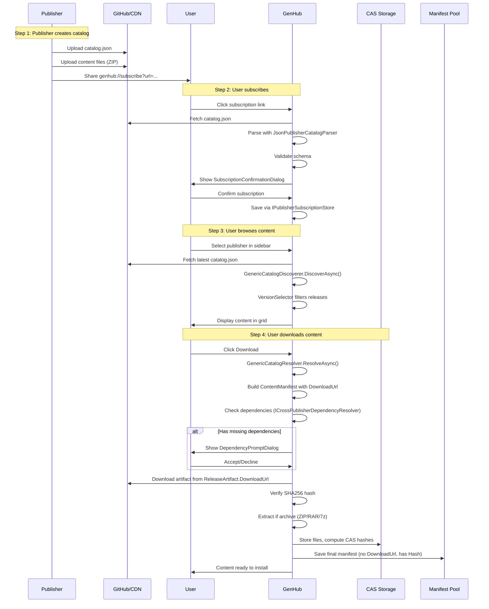

# Creator Publishing Architecture: Complete Implementation Plan

**Version**: 2.0.0
**Status**: READY FOR IMPLEMENTATION
**Last Updated**: 2026-01-14

---

## Quick Reference

| Workstream | Owner | Dependencies | Status |
| :--- | :--- | :--- | :--- |
| **WS1**: Core Models | AI-1 | None | Ready |
| **WS2**: Subscription System | AI-2 | WS1 | Ready |
| **WS3**: Discovery Pipeline | AI-3 | WS1, WS2 | Ready |
| **WS4**: Resolution & Manifest | AI-4 | WS1, WS3 | Ready |
| **WS5**: Dependency Resolution | AI-5 | WS1, WS4 | Ready |
| **WS6**: UI Integration | AI-6 | WS2, WS3, WS4 | Ready |

---

## Table of Contents

1. [Executive Summary](#1-executive-summary)
2. [Existing Infrastructure](#2-existing-infrastructure)
3. [Workstream 1: Core Models](#3-workstream-1-core-models)
4. [Workstream 2: Subscription System](#4-workstream-2-subscription-system)
5. [Workstream 3: Discovery Pipeline](#5-workstream-3-discovery-pipeline)
6. [Workstream 4: Resolution & Manifest Generation](#6-workstream-4-resolution--manifest-generation)
7. [Workstream 5: Dependency Resolution](#7-workstream-5-dependency-resolution)
8. [Workstream 6: UI Integration](#8-workstream-6-ui-integration)
9. [Complete Catalog JSON Schema](#9-complete-catalog-json-schema)
10. [End-to-End Data Flow](#10-end-to-end-data-flow)
11. [Verification Plan](#11-verification-plan)

---

## 1. Executive Summary

### Core Architecture Decisions

| Decision | Answer |
| :--- | :--- |
| **Who creates manifests?** | GenHub generates on download (not publishers) |
| **What do publishers host?** | Single `catalog.json` file + content files on CDN |
| **When are dependencies resolved?** | At download time, with user prompts |
| **Where does rich metadata live?** | In catalog (`ContentRichMetadata`) |
| **How do catalog URLs update?** | Via `catalogMirrors` field |

### Data Location Summary

| Data | Location | Why |
| :--- | :--- | :--- |
| Publisher identity | Catalog | Authored by publisher |
| Content metadata | Catalog | Publisher provides |
| Rich media URLs | Catalog | Publisher hosts assets |
| Dependencies declaration | Catalog | Publisher knows requirements |
| Download URLs | Catalog | Publisher controls hosting |
| File hashes (CAS) | Manifest | Computed after download |
| Installation instructions | Manifest | Generated by content type |

---

## 2. Existing Infrastructure

### 2.1 Models That Exist (NO CHANGES NEEDED)

| File | Path | Purpose |
| :--- | :--- | :--- |
| `PublisherCatalog.cs` | `GenHub.Core/Models/Providers/` | Root catalog structure |
| `CatalogContentItem.cs` | `GenHub.Core/Models/Providers/` | Content item in catalog |
| `ContentRelease.cs` | `GenHub.Core/Models/Providers/` | Version/release info |
| `ReleaseArtifact.cs` | `GenHub.Core/Models/Providers/` | Downloadable file |
| `CatalogDependency.cs` | `GenHub.Core/Models/Providers/` | Dependency reference |
| `ContentRichMetadata.cs` | `GenHub.Core/Models/Providers/` | Banners, screenshots, videos |
| `PublisherProfile.cs` | `GenHub.Core/Models/Providers/` | Publisher branding |
| `PublisherSubscription.cs` | `GenHub.Core/Models/Providers/` | User subscription |
| `PublisherReferral.cs` | `GenHub.Core/Models/Providers/` | Cross-publisher reference |

### 2.2 Interfaces That Exist (NO CHANGES NEEDED)

| File | Path | Purpose |
| :--- | :--- | :--- |
| `IPublisherSubscriptionStore.cs` | `GenHub.Core/Interfaces/Providers/` | Subscription CRUD |
| `IPublisherCatalogParser.cs` | `GenHub.Core/Interfaces/Providers/` | Catalog parsing |
| `IPublisherCatalogRefreshService.cs` | `GenHub.Core/Interfaces/Providers/` | Catalog refresh |
| `IVersionSelector.cs` | `GenHub.Core/Interfaces/Providers/` | Version filtering |
| `IContentDiscoverer.cs` | `GenHub.Core/Interfaces/Content/` | Content discovery |
| `IContentResolver.cs` | `GenHub.Core/Interfaces/Content/` | Manifest resolution |
| `IContentManifestBuilder.cs` | `GenHub.Core/Interfaces/Manifest/` | Manifest building |

### 2.3 Services That Exist (NO CHANGES NEEDED)

| File | Path | Purpose |
| :--- | :--- | :--- |
| `GenericCatalogDiscoverer.cs` | `GenHub/Features/Content/Services/Catalog/` | Fetch & discover |
| `GenericCatalogResolver.cs` | `GenHub/Features/Content/Services/Catalog/` | Create manifest |
| `JsonPublisherCatalogParser.cs` | `GenHub/Features/Content/Services/Catalog/` | Parse JSON catalog |
| `PublisherCatalogRefreshService.cs` | `GenHub/Features/Content/Services/Catalog/` | Refresh catalogs |
| `PublisherSubscriptionStore.cs` | `GenHub/Features/Content/Services/Catalog/` | Store subscriptions |
| `VersionSelector.cs` | `GenHub/Features/Content/Services/Catalog/` | Filter versions |
| `ContentManifestBuilder.cs` | `GenHub/Features/Manifest/` | Build manifests |

### 2.4 UI That Exists (NEEDS ENHANCEMENT)

| File | Path | Current State |
| :--- | :--- | :--- |
| `DownloadsBrowserViewModel.cs` | `GenHub/Features/Downloads/ViewModels/` | Needs subscribed publisher integration |
| `DownloadsBrowserView.axaml` | `GenHub/Features/Downloads/Views/` | Needs sidebar for subscribed publishers |
| `SubscriptionConfirmationViewModel.cs` | `GenHub/Features/Content/ViewModels/Catalog/` | Exists |
| `SubscriptionConfirmationDialog.axaml` | `GenHub/Features/Downloads/Views/` | Exists |
| `ContentDetailView.axaml` | `GenHub/Features/Downloads/Views/` | Needs rich metadata display |

---

## 3. Workstream 1: Core Models

**Owner**: AI-1
**Dependencies**: None
**Effort**: Small (2-3 changes)

### 3.1 Changes Required

#### 3.1.1 Add `catalogMirrors` to `PublisherCatalog.cs`

**File**: `z:\GenHub\GenHub\GenHub.Core\Models\Providers\PublisherCatalog.cs`

```csharp
/// <summary>
/// Gets or sets alternate catalog URLs for redundancy and migration.
/// </summary>
[JsonPropertyName("catalogMirrors")]
public List<string> CatalogMirrors { get; set; } = [];
```

#### 3.1.2 Add `isFeatured` to `ContentRelease.cs`

**File**: `z:\GenHub\GenHub\GenHub.Core\Models\Providers\ContentRelease.cs`

```csharp
/// <summary>
/// Gets or sets a value indicating whether this release should be featured/highlighted.
/// </summary>
[JsonPropertyName("isFeatured")]
public bool IsFeatured { get; set; }
```

#### 3.1.3 Add `TrustLevel` enum if not exists

**File**: `z:\GenHub\GenHub\GenHub.Core\Models\Enums\TrustLevel.cs`

```csharp
namespace GenHub.Core.Models.Enums;

/// <summary>
/// Trust level for publisher content.
/// </summary>
public enum TrustLevel
{
    /// <summary>
    /// New or untrusted publisher. Content requires extra scrutiny.
    /// </summary>
    Untrusted = 0,

    /// <summary>
    /// User has explicitly trusted this publisher.
    /// </summary>
    Trusted = 1,

    /// <summary>
    /// Publisher verified by GenHub team.
    /// </summary>
    Verified = 2,
}
```

### 3.2 Verification Steps

1. Build project to ensure no compile errors
2. Run existing tests to ensure no regressions

---

## 4. Workstream 2: Subscription System

**Owner**: AI-2
**Dependencies**: WS1 (TrustLevel enum)
**Effort**: Small (existing implementation, minor enhancements)

### 4.1 Current State

The subscription system is **already implemented**:
- `IPublisherSubscriptionStore` interface ✅
- `PublisherSubscriptionStore` implementation ✅
- `PublisherSubscription` model ✅

### 4.2 Enhancements Required

#### 4.2.1 URI Scheme Handler

**File**: `z:\GenHub\GenHub\GenHub\Infrastructure\SingleInstance\SingleInstanceCommandReceiver.cs`

Ensure `genhub://subscribe?url=<catalog_url>` is handled:

```csharp
// In ProcessCommand or similar method:
if (uri.Scheme == "genhub" && uri.Host == "subscribe")
{
    var catalogUrl = HttpUtility.ParseQueryString(uri.Query)["url"];
    if (!string.IsNullOrEmpty(catalogUrl))
    {
        await ShowSubscriptionConfirmationAsync(catalogUrl);
    }
}
```

#### 4.2.2 Subscription Confirmation Flow

The `SubscriptionConfirmationViewModel` should:
1. Fetch catalog from URL
2. Parse with `JsonPublisherCatalogParser`
3. Display publisher info for confirmation
4. On confirm: call `IPublisherSubscriptionStore.AddSubscriptionAsync()`

### 4.3 Verification Steps

1. Test `genhub://subscribe?url=...` link handling
2. Verify subscription persists after app restart
3. Verify subscription appears in sidebar

---

## 5. Workstream 3: Discovery Pipeline

**Owner**: AI-3
**Dependencies**: WS1, WS2
**Effort**: Medium (existing implementation, integration needed)

### 5.1 Current State

- `GenericCatalogDiscoverer` exists ✅
- `JsonPublisherCatalogParser` exists ✅
- `VersionSelector` exists ✅

### 5.2 Integration Required

#### 5.2.1 Add Subscribed Publishers to Downloads Sidebar

**File**: `z:\GenHub\GenHub\GenHub\Features\Downloads\ViewModels\DownloadsBrowserViewModel.cs`

```csharp
// In InitializePublishersAsync() or similar:

// After static publishers (ModDB, CNCLabs, etc.)
var subscriptionsResult = await _subscriptionStore.GetSubscriptionsAsync();
if (subscriptionsResult.Success)
{
    foreach (var subscription in subscriptionsResult.Data!)
    {
        Publishers.Add(new PublisherItemViewModel
        {
            PublisherId = subscription.PublisherId,
            DisplayName = subscription.PublisherName,
            IconUrl = subscription.AvatarUrl,
            IsSubscribed = true,
        });
    }
}
```

#### 5.2.2 Get Discoverer for Subscribed Publisher

**File**: `z:\GenHub\GenHub\GenHub\Features\Downloads\ViewModels\DownloadsBrowserViewModel.cs`

```csharp
private IContentDiscoverer? GetDiscovererForPublisher(string publisherId)
{
    return publisherId switch
    {
        // Existing static publishers...
        "moddb" => _serviceProvider.GetRequiredService<ModDBDiscoverer>(),
        "cnclabs" => _serviceProvider.GetRequiredService<CNCLabsMapDiscoverer>(),
        // ... etc

        // NEW: Check if subscribed publisher
        _ => GetSubscribedPublisherDiscoverer(publisherId),
    };
}

private IContentDiscoverer? GetSubscribedPublisherDiscoverer(string publisherId)
{
    var subscriptionResult = await _subscriptionStore.GetSubscriptionAsync(publisherId);
    if (!subscriptionResult.Success || subscriptionResult.Data == null)
        return null;

    var discoverer = _serviceProvider.GetRequiredService<GenericCatalogDiscoverer>();
    discoverer.Configure(subscriptionResult.Data);
    return discoverer;
}
```

### 5.3 Data Flow

```
User selects subscribed publisher in sidebar
        ↓
DownloadsBrowserViewModel.RefreshContentAsync()
        ↓
GetDiscovererForPublisher(publisherId) → GenericCatalogDiscoverer
        ↓
GenericCatalogDiscoverer.DiscoverAsync()
        ↓
  1. Fetch catalog from subscription.CatalogUrl
  2. Parse with JsonPublisherCatalogParser
  3. Apply VersionSelector filters
  4. Return ContentSearchResult[]
        ↓
Display in content grid
```

### 5.4 Verification Steps

1. Subscribe to a test publisher
2. Verify publisher appears in sidebar
3. Select publisher, verify content loads
4. Verify search/filter works

---

## 6. Workstream 4: Resolution & Manifest Generation

**Owner**: AI-4
**Dependencies**: WS1, WS3
**Effort**: Medium (existing implementation, download integration)

### 6.1 Current State

- `GenericCatalogResolver` exists ✅
- `ContentManifestBuilder` exists ✅

### 6.2 Resolution Flow

```csharp
// GenericCatalogResolver.ResolveAsync() flow:

// 1. Extract catalog data from search result metadata
var release = JsonSerializer.Deserialize<ContentRelease>(
    searchResult.ResolverMetadata["releaseJson"]);
var contentItem = JsonSerializer.Deserialize<CatalogContentItem>(
    searchResult.ResolverMetadata["catalogItemJson"]);
var publisher = JsonSerializer.Deserialize<PublisherProfile>(
    searchResult.ResolverMetadata["publisherProfileJson"]);

// 2. Build manifest
var builder = _manifestBuilder
    .WithBasicInfo(publisher.Id, contentItem.Name, release.Version)
    .WithContentType(contentItem.ContentType, contentItem.TargetGame)
    .WithPublisher(publisher.Name, publisher.Website ?? "", ...)
    .WithMetadata(contentItem.Description, contentItem.Tags, ...);

// 3. Add artifact for download
var primaryArtifact = release.Artifacts.FirstOrDefault(a => a.IsPrimary)
    ?? release.Artifacts.First();

// This sets ManifestFile.DownloadUrl for later acquisition
await builder.AddRemoteFileAsync(
    relativePath: primaryArtifact.Filename,
    downloadUrl: primaryArtifact.DownloadUrl,
    sourceType: ContentSourceType.ContentAddressable);

// 4. Add dependencies (converted from CatalogDependency)
foreach (var dep in release.Dependencies)
{
    builder.AddDependency(
        id: GenerateManifestId(dep),
        name: dep.ContentId,
        dependencyType: ContentType.Mod,
        installBehavior: dep.IsOptional
            ? DependencyInstallBehavior.Optional
            : DependencyInstallBehavior.RequireExisting,
        minVersion: dep.VersionConstraint ?? "");
}

return builder.Build();
```

### 6.3 ManifestFile.DownloadUrl Lifecycle

| Stage | DownloadUrl | Hash | SourceType |
| :--- | :--- | :--- | :--- |
| After Resolution | Set (artifact URL) | Empty | ContentAddressable |
| During Download | Used to fetch file | Computed | ContentAddressable |
| After CAS Storage | Cleared | Set | ContentAddressable |
| In Manifest Pool | N/A | Set | ContentAddressable |

### 6.4 Verification Steps

1. Click download on content from subscribed publisher
2. Verify manifest is created correctly
3. Verify file downloads from artifact URL
4. Verify file is stored in CAS with correct hash

---

## 7. Workstream 5: Dependency Resolution

**Owner**: AI-5
**Dependencies**: WS1, WS4
**Effort**: Large (new implementation)

### 7.1 New Components Needed

#### 7.1.1 Interface: `ICrossPublisherDependencyResolver`

**File**: `z:\GenHub\GenHub\GenHub.Core\Interfaces\Content\ICrossPublisherDependencyResolver.cs`

```csharp
namespace GenHub.Core.Interfaces.Content;

/// <summary>
/// Resolves dependencies that may come from different publishers.
/// </summary>
public interface ICrossPublisherDependencyResolver
{
    /// <summary>
    /// Checks which dependencies are missing and need installation.
    /// </summary>
    Task<OperationResult<IEnumerable<MissingDependency>>> CheckMissingDependenciesAsync(
        ContentManifest manifest,
        CancellationToken cancellationToken = default);

    /// <summary>
    /// Fetches a catalog from an external publisher to resolve a dependency.
    /// </summary>
    Task<OperationResult<PublisherCatalog>> FetchExternalCatalogAsync(
        string catalogUrl,
        CancellationToken cancellationToken = default);

    /// <summary>
    /// Finds content that satisfies a dependency.
    /// </summary>
    Task<OperationResult<ContentSearchResult?>> FindDependencyContentAsync(
        CatalogDependency dependency,
        CancellationToken cancellationToken = default);
}
```

#### 7.1.2 Model: `MissingDependency`

**File**: `z:\GenHub\GenHub\GenHub.Core\Models\Content\MissingDependency.cs`

```csharp
namespace GenHub.Core.Models.Content;

/// <summary>
/// Represents a dependency that is not installed.
/// </summary>
public class MissingDependency
{
    public ContentDependency Dependency { get; set; } = new();
    public CatalogDependency? CatalogDependency { get; set; }
    public ContentSearchResult? ResolvableContent { get; set; }
    public bool CanAutoInstall => ResolvableContent != null;
    public string? CatalogUrl { get; set; }
}
```

#### 7.1.3 Service: `CrossPublisherDependencyResolver`

**File**: `z:\GenHub\GenHub\GenHub\Features\Content\Services\Catalog\CrossPublisherDependencyResolver.cs`

Implementation should:
1. Check if each dependency exists in `ContentManifestPool`
2. If not, check if we're subscribed to the dependency's publisher
3. If not subscribed, use `CatalogDependency.CatalogUrl` to fetch catalog
4. Find matching content in catalog
5. Return `MissingDependency` list for UI

### 7.2 Integration with Download Flow

**File**: `z:\GenHub\GenHub\GenHub\Features\Downloads\ViewModels\DownloadsBrowserViewModel.cs`

```csharp
private async Task DownloadContentAsync(ContentGridItemViewModel item, CancellationToken ct)
{
    // Get resolver
    var resolver = GetResolverForPublisher(item.ProviderName);

    // Resolve to manifest
    var manifestResult = await resolver.ResolveAsync(item.SearchResult, ct);
    if (!manifestResult.Success) return;

    var manifest = manifestResult.Data!;

    // NEW: Check dependencies
    var missingDeps = await _dependencyResolver.CheckMissingDependenciesAsync(manifest, ct);
    if (missingDeps.Success && missingDeps.Data!.Any())
    {
        // Show dependency prompt dialog
        var decision = await ShowDependencyPromptAsync(missingDeps.Data!);

        if (decision == DependencyDecision.InstallAll)
        {
            foreach (var dep in missingDeps.Data!)
            {
                if (dep.CanAutoInstall)
                {
                    await DownloadContentAsync(dep.ResolvableContent!, ct);
                }
            }
        }
        else if (decision == DependencyDecision.Cancel)
        {
            return; // User cancelled
        }
        // else: decision == DependencyDecision.SkipDependencies - continue without deps
    }

    // Continue with main download...
    await DownloadAndStoreAsync(manifest, ct);
}
```

### 7.3 Dependency Prompt Dialog

**New Files**:
- `DependencyPromptViewModel.cs` in `Features/Downloads/ViewModels/`
- `DependencyPromptDialog.axaml` in `Features/Downloads/Views/`

### 7.4 Verification Steps

1. Create addon with dependency on mod
2. Download addon without mod installed
3. Verify dependency prompt appears
4. Accept - verify mod downloads first, then addon
5. Verify both in manifest pool

---

## 8. Workstream 6: UI Integration

**Owner**: AI-6
**Dependencies**: WS2, WS3, WS4
**Effort**: Medium (UI enhancements)

### 8.1 Components to Enhance

#### 8.1.1 Publisher Sidebar (Subscribed Publishers Section)

**File**: `z:\GenHub\GenHub\GenHub\Features\Downloads\Views\PublisherSidebarView.axaml`

Add section for "Subscribed Publishers" below built-in publishers:

```xml
<!-- Subscribed Publishers Section -->
<TextBlock Text="MY SUBSCRIPTIONS"
           FontSize="11"
           Opacity="0.6"
           Margin="16,16,0,8"/>

<ItemsControl ItemsSource="{Binding SubscribedPublishers}">
    <ItemsControl.ItemTemplate>
        <DataTemplate>
            <controls:PublisherCardView />
        </DataTemplate>
    </ItemsControl.ItemTemplate>
</ItemsControl>
```

#### 8.1.2 Content Detail View (Rich Metadata)

**File**: `z:\GenHub\GenHub\GenHub\Features\Downloads\Views\ContentDetailView.axaml`

Add support for:
- Banner image (header)
- Video embed (YouTube/direct)
- Screenshot gallery
- License info
- Documentation link

```xml
<!-- Banner Image -->
<asyncImageLoader:AdvancedImage
    Source="{Binding BannerUrl}"
    Height="200"
    Stretch="UniformToFill"/>

<!-- Screenshot Gallery -->
<ItemsControl ItemsSource="{Binding Screenshots}">
    <ItemsControl.ItemsPanel>
        <ItemsPanelTemplate>
            <WrapPanel />
        </ItemsPanelTemplate>
    </ItemsControl.ItemsPanel>
    <ItemsControl.ItemTemplate>
        <DataTemplate>
            <asyncImageLoader:AdvancedImage
                Source="{Binding}"
                Width="160" Height="90"
                Margin="4"/>
        </DataTemplate>
    </ItemsControl.ItemTemplate>
</ItemsControl>
```

#### 8.1.3 Subscription Management UI

Add ability to:
- Unsubscribe from publisher (right-click menu)
- View publisher details
- Set trust level

### 8.2 Verification Steps

1. Subscribe to publisher with rich metadata
2. View content detail
3. Verify banner displays
4. Verify screenshots display
5. Right-click publisher, verify unsubscribe works

---

## 9. Complete Catalog JSON Schema

Publishers create this file:

```json
{
  "$schemaVersion": 1,

  "publisher": {
    "id": "my-mods",
    "name": "My Awesome Mods",
    "avatarUrl": "https://avatars.githubusercontent.com/u/12345",
    "website": "https://mymods.github.io",
    "supportUrl": "https://discord.gg/mymods",
    "contactEmail": "contact@mymods.com"
  },

  "content": [
    {
      "id": "super-mod",
      "name": "Super Mod",
      "description": "An amazing mod that changes everything.",
      "contentType": "Mod",
      "targetGame": "ZeroHour",
      "tags": ["gameplay", "units", "balance"],

      "metadata": {
        "bannerUrl": "https://i.imgur.com/banner.jpg",
        "screenshotUrls": [
          "https://i.imgur.com/screen1.jpg",
          "https://i.imgur.com/screen2.jpg"
        ],
        "videoUrl": "https://www.youtube.com/watch?v=xyz",
        "documentationUrl": "https://github.com/mymods/super-mod/wiki",
        "author": "ModAuthor",
        "license": "MIT"
      },

      "releases": [
        {
          "version": "2.0.0",
          "releaseDate": "2026-01-14T00:00:00Z",
          "isLatest": true,
          "isPrerelease": false,
          "isFeatured": true,
          "changelog": "## What's New\n- New units\n- Balance changes",

          "artifacts": [
            {
              "filename": "SuperMod-2.0.0.zip",
              "downloadUrl": "https://github.com/.../SuperMod-2.0.0.zip",
              "size": 15728640,
              "sha256": "abc123def456...",
              "isPrimary": true
            }
          ],

          "dependencies": []
        },
        {
          "version": "1.5.0",
          "releaseDate": "2025-06-01T00:00:00Z",
          "isLatest": false,
          "artifacts": [
            {
              "filename": "SuperMod-1.5.0.zip",
              "downloadUrl": "https://github.com/.../SuperMod-1.5.0.zip",
              "size": 14000000,
              "sha256": "def789...",
              "isPrimary": true
            }
          ],
          "dependencies": []
        }
      ]
    },
    {
      "id": "super-addon",
      "name": "Super Addon",
      "description": "An addon for Super Mod.",
      "contentType": "Addon",
      "targetGame": "ZeroHour",
      "tags": ["addon", "units"],

      "releases": [
        {
          "version": "1.0.0",
          "releaseDate": "2026-01-10T00:00:00Z",
          "isLatest": true,

          "artifacts": [
            {
              "filename": "SuperAddon-1.0.0.zip",
              "downloadUrl": "https://github.com/.../SuperAddon-1.0.0.zip",
              "size": 5000000,
              "sha256": "xyz789...",
              "isPrimary": true
            }
          ],

          "dependencies": [
            {
              "publisherId": "my-mods",
              "contentId": "super-mod",
              "versionConstraint": ">=2.0.0",
              "isOptional": false,
              "catalogUrl": "https://mymods.github.io/catalog.json"
            }
          ]
        }
      ]
    }
  ],

  "referrals": [
    {
      "publisherId": "friend-mods",
      "catalogUrl": "https://friend-mods.github.io/catalog.json",
      "displayName": "Friend's Mods",
      "description": "Check out these compatible mods!"
    }
  ],

  "catalogMirrors": [
    "https://mymods.github.io/catalog.json",
    "https://cdn.mymods.com/catalog.json"
  ],

  "lastUpdated": "2026-01-14T00:00:00Z"
}
```

---

## 10. End-to-End Data Flow



---

## 11. Verification Plan

### 11.1 Test Catalog Setup

Create and host at `https://gist.githubusercontent.com/.../catalog.json`:

```json
{
  "$schemaVersion": 1,
  "publisher": { "id": "test-pub", "name": "Test Publisher" },
  "content": [
    {
      "id": "test-mod",
      "name": "Test Mod",
      "contentType": "Mod",
      "targetGame": "ZeroHour",
      "releases": [{
        "version": "1.0.0",
        "isLatest": true,
        "artifacts": [{
          "filename": "test.zip",
          "downloadUrl": "https://.../test.zip",
          "size": 1024,
          "sha256": "...",
          "isPrimary": true
        }]
      }]
    }
  ]
}
```

### 11.2 Test Scenarios

| # | Scenario | Expected Result |
|---|----------|-----------------|
| 1 | Subscribe via URI | Publisher appears in sidebar |
| 2 | Select subscribed publisher | Content loads in grid |
| 3 | Download content | File saved to CAS, manifest in pool |
| 4 | Download with dependency | Dependency prompt shown |
| 5 | Accept dependency install | Both items downloaded |
| 6 | Unsubscribe | Publisher removed from sidebar |
| 7 | Invalid catalog URL | Error message shown |
| 8 | Invalid catalog schema | Error message, subscription rejected |

### 11.3 Unit Tests to Create

| Test File | Tests |
|-----------|-------|
| `JsonPublisherCatalogParserTests.cs` | Schema validation, parsing |
| `VersionSelectorTests.cs` | Latest only, all versions |
| `GenericCatalogResolverTests.cs` | Manifest generation |
| `CrossPublisherDependencyResolverTests.cs` | Dependency checking |

---

## 12. Summary: Files to Create/Modify

### 12.1 New Files

| File | Workstream |
|------|------------|
| `TrustLevel.cs` | WS1 |
| `ICrossPublisherDependencyResolver.cs` | WS5 |
| `MissingDependency.cs` | WS5 |
| `CrossPublisherDependencyResolver.cs` | WS5 |
| `DependencyPromptViewModel.cs` | WS5 |
| `DependencyPromptDialog.axaml` | WS5 |

### 12.2 Modified Files

| File | Workstream | Changes |
|------|------------|---------|
| `PublisherCatalog.cs` | WS1 | Add `CatalogMirrors` |
| `ContentRelease.cs` | WS1 | Add `IsFeatured` |
| `DownloadsBrowserViewModel.cs` | WS3, WS5 | Add subscribed publisher support |
| `PublisherSidebarView.axaml` | WS6 | Add subscriptions section |
| `ContentDetailView.axaml` | WS6 | Add rich metadata display |
| `ContentPipelineModule.cs` | WS5 | Register new services |

---

*End of Implementation Plan*
